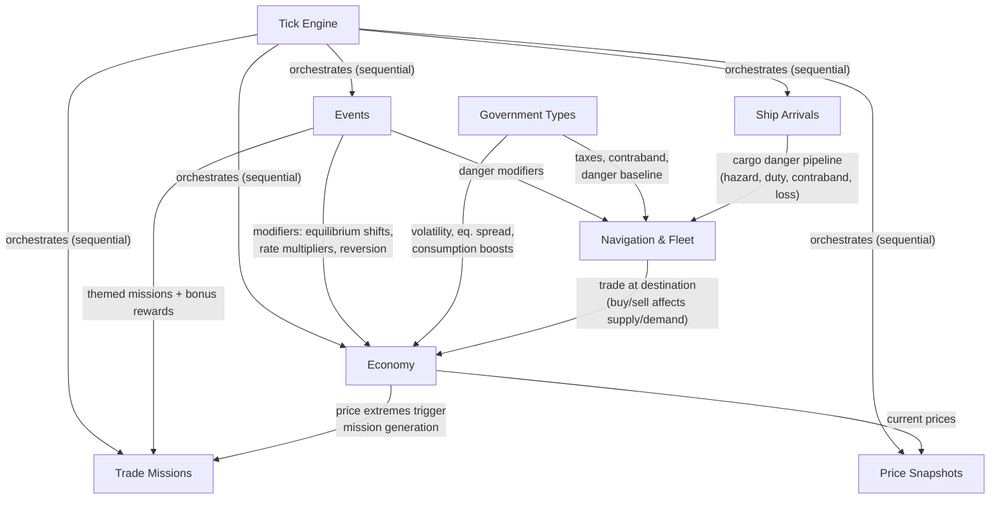

# Stellar Trader — Functional Specification

Master specification for the game. Describes what the game does, how systems connect, and links to detailed design docs. No code — for implementation details see `CLAUDE.md`.

---

## Game Overview

Browser-based multiplayer space trading simulation. Players navigate a network of star systems, trade goods between markets, complete delivery missions, and grow their wealth. The game world features a living economy that evolves independently through tick-based simulation, disrupted by dynamic events.

### Core Loop

```
Travel → Discover → Trade → Profit → Upgrade → Repeat
```

Players move ships between star systems, buy goods where they're cheap (surplus), sell where they're expensive (deficit), and complete delivery missions for guaranteed rewards. Events disrupt markets, creating new opportunities and dangers.

---

## Active Systems

These systems are implemented and functional. Each has a detailed design doc.

### Universe & Map — [detailed spec](./design/active/universe.md)
200 star systems across 8 regions. Systems are connected by jump lanes forming a navigable graph. Each system has an economy type (agricultural, extraction, refinery, industrial, tech, core) and belongs to a region with a government type. The map displays in two levels: region overview and system detail. Gateway systems serve as chokepoints for inter-region travel.

### Economy — [detailed spec](./design/active/economy.md)
12 goods in 3 tiers (raw, processed, advanced) traded at station markets. Prices emerge from supply/demand ratios. Markets drift toward equilibrium through mean reversion, modified by production/consumption flows, random noise, event modifiers, and government effects. Each economy type specializes in producing certain goods and consuming others, creating natural trade routes.

### Events — [detailed spec](./design/active/events.md)
7 primary event types (war, plague, trade festival, mining boom, supply shortage, pirate raid, solar storm) plus 3 child events that spread from parents. Events spawn randomly, progress through multi-phase arcs, apply modifiers to markets and navigation danger, and spread to neighboring systems. Each phase has distinct economic and danger effects.

### Trading & Missions — [detailed spec](./design/active/trading.md)
Players buy and sell goods at station markets. Prices update dynamically based on supply/demand. Trade missions are auto-generated delivery contracts — import missions at high-price systems, export missions at low-price systems, and event-themed missions during active events. Missions reward credits on delivery plus the goods' sale value.

### Navigation & Fleet — [detailed spec](./design/active/navigation.md)
Players manage a fleet of ships (Shuttle for range, Freighter for cargo). Travel consumes fuel and takes time (tick-based). On arrival, cargo passes through a 4-stage danger pipeline: hazard incidents, import duty, contraband inspection, and event-based cargo loss. Government types and active events determine the risk profile of each destination.

### Tick Engine — [detailed spec](./design/active/tick-engine.md)
Game clock advancing every 5 seconds. 5 processors run sequentially: ship arrivals, events, economy, trade missions, price snapshots. Processors are topologically sorted by dependencies. Economy processes one region per tick (round-robin). Results are broadcast to clients via SSE with per-player event filtering.

### Auth & Players
User registration and login via NextAuth (JWT/Credentials). Each user has one player profile with credits and a fleet of ships. New players spawn at a core-economy system in a trade hub region with a starter Shuttle.

---

## System Interaction Map

How the active systems connect and affect each other:



Key interactions:
- **Events → Economy**: Event modifiers shift market equilibrium, multiply production/consumption rates, dampen price reversion
- **Events → Navigation**: Danger modifiers increase cargo loss risk on ship arrival
- **Events → Trade Missions**: Active events generate themed delivery contracts with bonus rewards
- **Economy → Trade Missions**: Price extremes (>2x or <0.5x base) trigger mission generation
- **Government → Economy**: Volatility scaling, equilibrium spread adjustment, consumption boosts
- **Government → Navigation**: Tax rates, contraband lists, inspection modifiers, danger baseline
- **Tick Engine → All**: Orchestrates processor execution order and broadcasts results via SSE

---

## Planned Systems

Designed but not yet implemented. Each has a design doc with full mechanics.

### Faction System — [detailed spec](./design/planned/faction-system.md)
Named factions controlling territory, waging wars, and driving player engagement. 6 initial major factions with distinct government types and political doctrines. Inter-faction relations drift toward conflict. Wars resolve through multi-round battles with weighted random outcomes. Players contribute through tiered involvement (economic support, strategic actions, direct operations). Territory changes hands through control score mechanics. Alliance system with size-based capacity limits.

### Player Progression — [detailed spec](./design/planned/player-progression.md)
Three-phase game arc: early game (manual trading, exploration, in-system missions), mid game (fleet expansion, minor facilities, faction alignment, early automation), late game (production empire, advanced automation, faction power broker). Progression transforms gameplay from hands-on piloting to fleet management to strategic oversight. Faction reputation gates ship access, mission quality, and war contribution tiers.

### System Enrichment — [detailed spec](./design/planned/system-enrichment.md)
System traits (physical properties like asteroid belts, habitable worlds, precursor ruins) determine economy type through affinity scoring. Traits have quality tiers (1–3) that modify production rates. Region themes weight trait generation for coherence. 16 faction facilities across 5 categories (ship & fleet, trade & economy, military & defence, research & production, social & governance) are trait-gated and tier-scaled. Facilities are strategic war targets — captured, damaged, or destroyed during conflicts.

### Ship Roster — [detailed spec](./design/planned/ship-roster.md)
12 ship classes across 3 size categories (small, medium, large) with 5 roles (trade, combat, scout, stealth, support). Size is the foundation stat — determines baseline evasion, stealth, cargo, and hull. 10 core stats per ship, with a derived combat power rating for large-scale faction battles. Faction-exclusive variants at tier-3 shipyards gated by Champion reputation. Fleet composition, escort mechanics, and operating costs create meaningful fleet management decisions.

### Ship Upgrades — [detailed spec](./design/planned/ship-upgrades.md)
Modular upgrade system with typed slots (engine, cargo, defence, systems). 2–5 slots per ship scaling with size. Upgrades personalise ships and gate gameplay mechanics — automation modules, smuggling compartments, scanner arrays. Installed at drydocks, with better modules at higher tiers. Stub — needs full design.

### Player Facilities — [detailed spec](./design/planned/player-facilities.md)
Player-owned base building at galactic scale. Production facilities (mining, refining, manufacturing) and infrastructure facilities (trade posts, warehouses, fuel stations). Economy-tied personal investments with a unified build system. Minor facilities mid game, major facilities late game. Assets at risk during territory changes. Stub — needs full design.

### In-System Gameplay — [detailed spec](./design/planned/in-system-gameplay.md)
Second major gameplay space alongside the universe map. Story content, missions, and activities within docked systems. Trait-driven mission flavour. Available from the start as immediate engaging content. Mix of singleplayer and multiplayer objectives. Stub — needs full design.

### Multiplayer Infrastructure — [detailed spec](./design/planned/multiplayer-infrastructure.md)
Player-to-player trading, alliances/guilds, communication, and coordination mechanics. Stub — needs full design.

### Simulation Enhancements — [detailed spec](./design/planned/simulation-enhancements.md)
Supply chain dependencies, seasonal cycles, NPC trade pressure, inter-region trade flows. Planned economy improvements.

---

## Design Doc Workflow

Design docs follow a lifecycle:

1. **Planned** (`docs/design/planned/`): Fully designed, not yet implemented. Source of truth for what will be built.
2. **Active** (`docs/design/active/`): Implemented and functional. Source of truth for what the game currently does. Updated when implementation changes.
3. **Archive** (`docs/design/archive/`): Historical design docs. Kept for reference but may be outdated.

When implementing a planned feature:
1. Complete and finalize the design doc
2. Implement the feature
3. Update the design doc to reflect any implementation changes
4. Move from `planned/` to `active/`
5. Update this SPEC.md to reflect the new system
