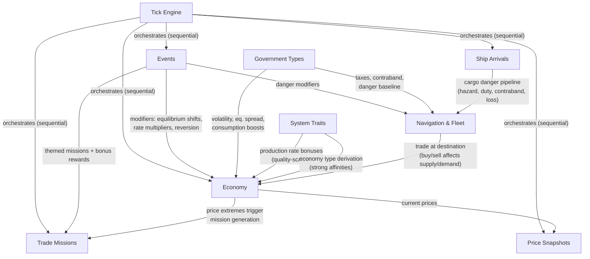

# Stellar Trader — Functional Specification

Master specification for the game. Describes what the game does, how systems connect, and links to detailed design docs. No code — for implementation details see `CLAUDE.md`.

---

## Game Overview

Browser-based multiplayer space trading simulation. Players navigate a network of star systems, trade goods between markets, complete delivery missions, and grow their wealth. The game world features a living economy that evolves independently through tick-based simulation, disrupted by dynamic events.

### Core Loop

```
Travel → Discover → Trade → Profit → Upgrade → Repeat
```

Players move ships between star systems, buy goods where they're cheap (surplus), sell where they're expensive (deficit), and complete delivery missions for guaranteed rewards. Events disrupt markets, creating new opportunities and dangers.

---

## Active Systems

These systems are implemented and functional. Each has a detailed design doc.

### Universe & Map — [detailed spec](./design/active/universe.md)
600 star systems across 24 regions (25 per region). Systems are connected by jump lanes forming a navigable graph. Each system has 2–4 traits (physical properties like asteroid belts, habitable worlds, precursor ruins) with quality tiers (1–3). Economy type (agricultural, extraction, refinery, industrial, tech, core) is derived bottom-up from trait affinities, not assigned directly. Each region has a government type and a dominant economy label. The map displays in two levels: region overview (neutral slate palette, economy-coloured labels) and system detail. Gateway systems serve as chokepoints for inter-region travel.

### Economy — [detailed spec](./design/active/economy.md)
12 goods in 3 tiers (raw, processed, advanced) traded at station markets. Prices emerge from supply/demand ratios. Markets drift toward equilibrium through mean reversion, modified by production/consumption flows, random noise, event modifiers, government effects, and system trait production bonuses. Each economy type specializes in producing certain goods and consuming others, creating natural trade routes. Trait quality scales production rates — a tier-3 asteroid belt system produces significantly more ore than a tier-1.

### Events — [detailed spec](./design/active/events.md)
7 primary event types (war, plague, trade festival, mining boom, supply shortage, pirate raid, solar storm) plus 3 child events that spread from parents. Events spawn randomly, progress through multi-phase arcs, apply modifiers to markets and navigation danger, and spread to neighboring systems. Each phase has distinct economic and danger effects.

### Trading & Missions — [detailed spec](./design/active/trading.md)
Players buy and sell goods at station markets. Prices update dynamically based on supply/demand. Trade missions are auto-generated delivery contracts — import missions at high-price systems, export missions at low-price systems, and event-themed missions during active events. Missions reward credits on delivery plus the goods' sale value.

### Navigation & Fleet — [detailed spec](./design/active/navigation.md)
Players manage a fleet of ships (Shuttle for range, Freighter for cargo). Travel consumes fuel and takes time (tick-based). On arrival, cargo passes through a 4-stage danger pipeline: hazard incidents, import duty, contraband inspection, and event-based cargo loss. Government types and active events determine the risk profile of each destination.

### Tick Engine — [detailed spec](./design/active/tick-engine.md)
Game clock advancing every 5 seconds. 5 processors run sequentially: ship arrivals, events, economy, trade missions, price snapshots. Processors are topologically sorted by dependencies. Economy processes one region per tick (round-robin). Results are broadcast to clients via SSE with per-player event filtering.

### Auth & Players
User registration and login via NextAuth (JWT/Credentials). Each user has one player profile with credits and a fleet of ships. New players spawn at a core-economy system in the region closest to the map center with a starter Shuttle.

---

## System Interaction Map

How the active systems connect and affect each other:



Key interactions:
- **Events → Economy**: Event modifiers shift market equilibrium, multiply production/consumption rates, dampen price reversion
- **Events → Navigation**: Danger modifiers increase cargo loss risk on ship arrival
- **Events → Trade Missions**: Active events generate themed delivery contracts with bonus rewards
- **Economy → Trade Missions**: Price extremes (>2x or <0.5x base) trigger mission generation
- **Government → Economy**: Volatility scaling, equilibrium spread adjustment, consumption boosts
- **Government → Navigation**: Tax rates, contraband lists, inspection modifiers, danger baseline
- **System Traits → Economy**: Trait quality scales production rates per good. Economy type is derived from trait strong affinities at generation
- **Tick Engine → All**: Orchestrates processor execution order and broadcasts results via SSE

---

## Planned Systems

Future systems are designed in `docs/design/planned/`. Each doc is a self-contained spec for a system that layers over the active implementation. See `docs/design/MIGRATION-NOTES.md` for the implementation roadmap and what changes in the active systems when each planned system ships.

---

## Design Doc Workflow

Design docs follow a lifecycle:

1. **Planned** (`docs/design/planned/`): Fully designed, not yet implemented. Source of truth for what will be built.
2. **Active** (`docs/design/active/`): Implemented and functional. Source of truth for what the game currently does. Updated when implementation changes.
3. **Archive** (`docs/design/archive/`): Historical design docs. Kept for reference but may be outdated.

When implementing a planned feature:
1. Complete and finalize the design doc
2. Implement the feature
3. Update the design doc to reflect any implementation changes
4. Move from `planned/` to `active/`
5. Update this SPEC.md to reflect the new system
