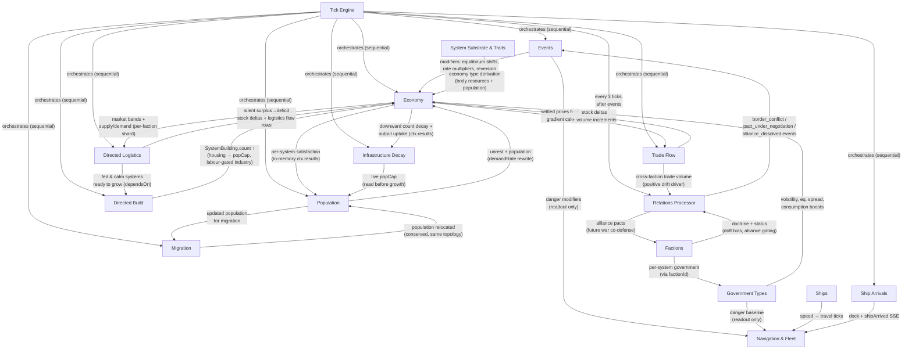

# Functional Specification

Master specification for the game. Describes what the game does, how systems connect, and links to detailed design docs. No code — for implementation details see `CLAUDE.md`.

> **⚠ Re-conception in progress (2026-07-06).** The game is pivoting from a browser-based
> multiplayer space-trading game to a **single-player grand-strategy game** — north star:
> [grand-strategy-vision.md](./planned/grand-strategy-vision.md). The Game Overview below describes
> the re-conceived game. The **Active Systems** sections describe the *implemented* code, which is
> mid-pivot: systems marked **cut** in the vision doc §4 (auth) still exist in code and are
> documented here until the Phase 1 teardown removes them.
> Missions/battles/combat were removed in teardown Sweep 1; personal trading, player
> reputation, notifications, and price history in Sweep 2; the arrival danger pipeline,
> convoys, shipyard/upgrades, and cargo in Sweep 3.

---

## Game Overview

Single-player grand-strategy game (working title pending — "Stellar Trader" no longer describes it). The player rules a spacefaring faction in a procedurally generated galaxy: starting from a small developed core, they colonise open space, develop worlds under real physical constraints (deposits, space, habitability, labour), steer a living simulated economy with population, unrest, migration, and logistics, and — eventually — convert economic strength into military power against AI factions running the same machinery. EU5-style control: everything is directly controllable and everything is automatable per domain. Design pillars and phasing in [grand-strategy-vision.md](./planned/grand-strategy-vision.md).

### Core Loop

```
Colonise → Develop → Supply → Specialise → Project power → Repeat
```

The player allocates each world's finite space between extraction, industry, and habitation (fractional magnitudes, not building slots), keeps their systems fed and calm through a logistics network whose effectiveness they invest in, specialises worlds into an interdependent economy, and grows population and industry toward the physical ceilings of their territory. Events perturb the physical world; unrest, migration, and decay punish neglect. War (deferred, designed) makes the economy's stakes lethal.

---

## Active Systems

These systems are implemented and functional. Each has a detailed design doc.

### Universe & Map — [detailed spec](./active/gameplay/universe.md)
Configurable universe scale controlled by `UNIVERSE_SCALE` env var — currently supports up to ~10,000 systems across 60 regions in a 25,000×25,000 map, with the goal of scaling as high as possible. Systems are connected by jump lanes forming a navigable graph. Each system belongs to one faction (which sets its government type) and one region (which contributes a `dominantEconomy` label for orientation). The map uses a WebGL canvas (Pixi.js) with a two-tier rendering pipeline: a point cloud shows all systems as dots at universe zoom, while tile-based viewport loading fetches detailed system data only for visible tiles at close zoom. A LOD engine crossfades between tiers — zoomed out shows the point cloud, Voronoi-derived region boundaries, fleet presence dots, and region name labels; zooming in progressively reveals system names, economy badges, ship counts, event indicators, and connection fuel costs. A map-mode toggle paints the territory polygons by faction (default), by region, by a per-system **stability** choropleth (the inverse of `unrest` — high unrest = low stability), or hides them entirely; additive trade-flow (market diffusion, straight particle streams) and logistics (directed faction hauls, curved convoy arcs) overlays sit on top of any mode, and the price overlay (a per-system halo) carries a buy/sell sub-toggle (price uses a green↔red deal-quality ramp). Gateway systems serve as chokepoints for inter-region travel. Data loading at this scale and per-player fog-of-war visibility are detailed in [map-data-loading](./active/engineering/map-data-loading.md).

### System Substrate & Traits — [detailed spec](./active/gameplay/system-traits.md)
Every system is built from a physical substrate — a sun (its class gates composition), 1–N bodies (planets, asteroid belts, gas giants) each with a finite **available space** (from body size) partitioned into per-resource **deposit slots** (each carrying a poor/average/good/rich **quality band**) and fungible **general space**, whose **habitable fraction** caps population — plus 0–2 narrative features. Economy type (agricultural, extraction, refinery, industrial, tech, core) is derived bottom-up from the system's effective deposit potential (slot caps × quality yields) and population — no direct assignment, no region biasing; the galaxy is **extraction-dominant by design** (raw building blocks are needed in volume, and gas giants with no habitable land are truly dead). Features (precursor ruins, anomalies, derelict fleets, etc.) carry no economic role: they have quality tiers (1–3), modify danger baselines, gate exploration sites, and influence event spawning. The faction-facing extensions (economy nudge on conquest, war targets) will be specced with the pivot's war phase (the old planned Facilities doc is deleted).

### Economy — [detailed spec](./active/gameplay/economy.md)
26 goods in 3 tiers (raw, processed, advanced) traded at station markets. Prices emerge from a single stock value per market via a pricing-anchor curve clamped to a **per-market band** — a demand-derived floor reserve and an infrastructure-derived ceiling (`Σ` building storage), replacing the legacy global `[5, 200]` — with intra-trade slippage and a bid-ask spread that make same-station round-trips unprofitable. Stock evolves through self-limiting production/consumption, band-relative noise, event modifiers, and government effects — equilibrium emerges from production/consumption balance plus spatial trade flow, with no mean-reversion and no separate demand axis. Production is capacity-driven and **input-gated**: each system has a seeded industrial base (`SystemBuilding` counts built onto the bodies' **available space** — extractors on deposit slots, factories on general space, population centres on habitable space), and per-good output equals `Σ count × outputPerUnit × effectiveFulfilment × inputGate × yield` where `effectiveFulfilment` is the head-count ratio `min(1, population / labour demand)` (population is the labour pool) further gated, for tier-1+ goods, by academy-licensed **skill ceilings** (see Economy Specialisation), `inputGate` throttles a tier-1+ good by the availability of its recipe inputs (1 for tier-0 extractables), and `yield` scales a tier-0 extractable by its deposit quality (1 for tier-1+). The 26 goods form a production chain: tier-1+ buildings draw their recipe inputs from local stock each tick, processed in recipe-topological order per system, so a shortage of any input **cascades** down the chain — cut an input's supply and every downstream good throttles in sequence. Consumption has two channels — universal civilian demand from a per-system **demand basis** (per-capita baseline + per-grade skilled-work consumption baskets — see Economy Specialisation S3) plus the production-input draw — and `demandRate` (the days-of-supply pricing denominator) sums both, so an input-heavy good (a refinery world's Ore) prices honestly rather than cheap-when-scarce. Economy type is a derived display label, not an input to the tick. **Population is dynamic** (Float, grows/declines/migrates): the economy processor records per-good satisfaction (`delivered / demanded`) each tick; the population processor integrates these into `unrest` (0…1), applies logistic growth/decline, and rewrites `demandRate` for the new population and its labour allocation; a migration processor then relocates population along the same intra-faction topology. Chronic unmet demand raises `unrest`; high `unrest` triggers a strike state that smoothly suppresses production (consumption is never suppressed). A per-system **stability** readout (the inverse of `unrest`) surfaces on the map as a choropleth and as a per-system badge, and on the system screen as a Population tab (magnitude, `popCap` utilisation, unrest/stability, strike state, per-good demand footprint) and a stability row on the Overview. **Infrastructure is dynamic too**: `SystemBuilding.count` decays **downward** each economy shard toward what is actively *used* — gentle disuse where built exceeds staffed-and-selling (production/extraction) or occupancy (housing), plus a catastrophic unrest-driven teardown above a threshold — so `popCap` recomputes live from the surviving housing and a failing system sheds its industry; housing rotting below its occupants displaces the overshoot as migration ⊕ death. The **Industry panel** surfaces this per building as available (shared land headroom) · built · in-use, health-coloured (stable / idle / collapsing) …and surfaces the skill-tiered labour model — a system Labour card (workforce + the two academy-licensed skill ceilings), per-building health glyphs, academy-named idle reasons, and per-grade staffing tooltips.

### Trade Simulation (Edge Flow) — [detailed spec](./active/gameplay/trade-simulation.md)
Goods flow along jump-lane edges driven by local price gradients, supplying the inter-system trade pressure player density alone cannot. No merchant entities — the simulator applies the same single stock delta a player trade would. Flow is bounded by **faction** borders, not regions: goods cross an edge only when both endpoints share a faction (region lines ignored, sovereign borders closed), and each edge's flow is distance-attenuated by its fuel cost. The processor sweeps a fixed work-budget slice of the open-edge graph each tick — decoupling per-tick work from faction-territory size — with per-edge player activity scaling that edge's flow back via wall-clock displacement so the simulator stays out of the way where players trade. The **same open-edge topology and work-budget slice** carry population migration (a parallel flow distinct from goods): population moves down-unrest / up-headroom along the same intra-faction graph, distance-attenuated, so people and goods always share one map. Flow events feed a map overlay and the per-system **Logistics tab** (imports/exports split by flowType — directed logistics solid, market diffusion hatched — plus production/consumption and volume history) — routes are inferred from the event log, not stored.

### Directed Logistics & Autonomic Agency — [detailed spec](./active/gameplay/economy-autonomic-agency.md)
The *recovery* counterpart to SP3.5 infrastructure decay: factions deliberately act on their own territory to counter the decay ratchet and feed the suppliable middle of the galaxy. Two mechanisms share one slow agency clock (48 ticks, per-faction shard) and one "supply vs need" reading per system (deficit/surplus against the days-of-supply anchor, with a self-supply gate). **Directed logistics** moves a faction's surplus to its own deficits above the diffusion cap — greedy nearest-surplus matching within a population-funded work budget (work = quantity × route cost), applied silently as stock deltas plus a `logistics`-tagged `TradeFlow` row, with the budget deliberately below total need so a residual (the negative space) remains. **Autonomic build** grows systems toward viable potential along a strict physical chain — habitable land → housing → population → industry: proactive housing leads (built ahead of population at *fed and calm* systems, capped at habitable land), population fills it, and labour-gated industry follows the resident workforce (a build can only add what already-present population can staff). Build and decay share one equilibrium (occupied housing, staffed-and-selling industry), so a viable system sits at potential with both ≈ 0. Free and capacity-bounded in this slice — no treasury, no money, no claimable contracts (the player-facing trade layer is a later rework). Logistics-first sequencing is deliberate: supply makes a system viable, and a viable system builds.

### Economy Specialisation — Skill-Tiered Labour — [detailed spec](./active/gameplay/economy-specialisation.md)
Manufacturing's specialisation gate (stage **S1** of a four-stage track). A good's staffing is a per-good 3-grade vector `(unskilled, skill1, skill2)` that **partitions** its head count; two **academy** buildings — a vocational school (skill-1) and a research institute (skill-2) — raise a *ceiling* on how much of the existing population may work each skilled grade (population stays a single scalar — skill is not a kind of person). Per-good output is gated by `effectiveFulfilment(tier)` = the head-count ratio min'd with the skill-fulfilment ratios (`skillCap / skillDemand`) the good's tier draws on, so a frontier world with **no academy physically cannot run tier-1+ manufacturing**, and a tech hub must sink space + population into academies (and so can't also be broad → it imports the rest). Academies eat general space, draw unskilled labour, decay toward the skill demand they actually serve, and are **co-built by the autonomic planner** as a buildable labour gate when a skill ceiling blocks a deficit-serving build. Per-good general-space `spaceCost` differentiates factory footprints (shipyards/foundries are large). Stages S2 (specialisation complexes) and S3 (demand concentration) are shipped — see the next sections; stage S4 (guardrails) remains planned — see the [track vision](./planned/economy-specialisation.md).

### Economy Specialisation — Specialisation Complexes — [detailed spec](./active/gameplay/economy-specialisation-s2-complexes.md)
Manufacturing's comparative advantage (stage **S2** of the track). Five production **families** partition the 18 tier-1+ goods (heavy industry, chemicals, electronics, armaments, consumer goods); each family has one **specialisation complex** — a non-producing anchor building (large general-space footprint, small unskilled staffing, **capped at one complex per system across all families** — "one industrial identity") whose presence multiplies the *yield* of every family good produced there, linearly up to one full complex. The buff folds into `buildingProduction`, so production, input demand, and the read services inherit it with no separate read path. Complexes decay toward the family throughput they actually buff (rated coverage), are seeded at each system's dominant family where projected throughput clears a floor, and are **co-built by the autonomic planner** exactly as academies are — charged to the same deficit-serving opportunity. Family goods score at their buffed per-unit, so an anchored site out-ranks a greenfield rival and production concentrates structurally (the snowball) — arresting the price-flattening a matured galaxy otherwise settles into. Nothing is restricted: the complex's footprint physically crowds out breadth. The Industry panel renders complexes as their own Specialisation group; tooltips list the family's goods and the current yield multiplier. Magnitudes are coarse first-cut, tuned in the single S1–S4 calibration pass.

### Economy Specialisation — Development-Tiered Demand — [detailed spec](./active/gameplay/economy-specialisation-s3-demand.md)
Demand's specialisation gradient (stage **S3** of the track). Civilian consumption derives from a per-system **demand basis** `{population, technicians, engineers}` instead of bare population: skilled work *actually performed* (from `computeLabourAllocation` — bounded by jobs, academy licence, and headcount, so a hub that loses its industry sheds the discretionary demand with it) adds per-grade **consumption baskets** on top of the flat per-capita baseline — the technician basket consumer_goods-dominant, the engineer basket luxuries-dominant with luxuries engineer-exclusive. Basics are never reduced; development only *adds* demand, so developed hubs become the galaxy's big discretionary importers exactly where S1/S2 space+labour scarcity stops broad self-supply — demand concentrates where supply can't (the signal derives from buildings + population only; no feedback circularity with satisfaction or unrest). Threaded through the single `consumptionRate` chokepoint so pricing, satisfaction weights, seed, and the live/sim tick adapters all inherit it; the Labour card's skill chips list each grade's basket, and Population-panel demand rows carry a base/technicians/engineers composition tooltip. Magnitudes are coarse first-cut, tuned in the single S1–S4 calibration pass.

### Events — [detailed spec](./active/gameplay/events.md)
12 primary event types (inner_system_conflict, plague, trade_festival, mining_boom, ore_glut, supply_shortage, pirate_raid, solar_storm, refugee_crisis, trade_embargo, tech_breakthrough, asteroid_strike), 2 child events that spread from parents (conflict_spillover, plague_risk), and 3 relations-owned event types spawned exclusively by the relations processor (border_conflict, pact_under_negotiation, alliance_dissolved — see Inter-Faction Relations below). Events spawn randomly (weighted by government type), progress through multi-phase arcs, apply modifiers to markets and navigation danger, and spread to neighboring systems. Each phase has distinct economic and danger effects.

### Market Inspection
The market screen is a read-only inspection surface: per-system current prices, stock levels, and a cross-system price comparison (heatmap overlay + comparison panel). Prices update dynamically based on each good's stock via the economy tick. Personal buy/sell trading was removed in the Phase 1 teardown — goods move through the simulated trade flow and directed logistics, not player hauling.

### Navigation & Fleet — [detailed spec](./active/gameplay/navigation.md)
Travel along jump-lane connections. Travel time scales with the ship's `speed` stat (faster ships = fewer ticks). Fuel is deducted at departure; refuelling is available while docked. Ships dock on arrival — the old 5-stage danger pipeline, convoys, cargo, and repair were removed in the Phase 1 teardown. System danger remains a world attribute displayed on the overview (government baseline + feature danger + body danger), consumed by nothing mechanically until events/war reuse it.

### Ships — [detailed spec](./active/gameplay/ship-roster.md)
12 ship classes across 3 sizes (small, medium, large) and 5 roles (trade, combat, scout, stealth, support). Size sets the baseline profile — small ships are nimble and stealthy; large ships absorb damage but can't hide or dodge. Combat-facing stats (hull, shield, firepower, evasion, stealth) are inert until the war layer; `speed` and fuel drive travel. Fleets are fixed (no purchase); ships return as faction assets in the war phase.

### Factions — [detailed spec](./active/gameplay/faction-system.md)
The political layer. 8 major factions plus minor factions (12 at default scale, 18 at 10K) own the universe — every star system has a `factionId`. Each faction has a government type (one of 8: federation, corporate, authoritarian, frontier, cooperative, technocratic, militarist, theocratic) that drives its economic identity, and a doctrine (one of 5: expansionist, protectionist, mercantile, hegemonic, opportunistic) that drives political behaviour. Government type sourced per-system from the owning faction (no longer per-region). Faction status (dominant / major / regional / minor) is derived from share of total factioned systems with hysteresis at the boundaries — scale-independent, so the same thresholds work at 600 and 10K. Minors are placed at world-gen by four archetypes (buffer, frontier, enclave, cluster) and protected by a 5-system floor. Faction overview UI lists factions with a detail page showing territory sample, doctrine, government, relations, alliances, recent border conflicts, and your own reputation.

### Inter-Faction Relations — [detailed spec](./active/gameplay/faction-system.md#2-inter-faction-relations)
Per-pair score (-100 to +100) drifts every 3 ticks via a dedicated relations processor. Drift drivers: a constant negative baseline ("peace needs maintenance"), border friction (cross-faction jump lanes), doctrine compatibility, sparse government opposition, common-enemy bonus, recent trade volume, active-alliance maintenance, and alliance-with-enemy penalty. Five tiers (allied +75 / friendly +25 / neutral / unfriendly -25 / hostile -75). The processor spawns `border_conflict` events (one active per pair, three phases applying danger and production modifiers) when a pair drops to ≤-25, telegraphs alliance formation via `pact_under_negotiation` events (5–10 tick negotiation window, must hold ≥+60 to confirm), and dissolves alliances below +50 via `alliance_dissolved` events. Pact records and per-pair history (last 10 drift entries) are stored.

### Tick Engine — [detailed spec](./active/engineering/tick-engine.md)
Game clock advancing every 5 seconds. 10 processors run sequentially in topological order: ship arrivals, events, economy, infrastructure decay (depends on economy), population (depends on economy + infrastructure decay), migration (depends on population), trade flow, directed logistics (depends on economy), directed build (depends on directed logistics), relations (every 3 ticks, depends on events). Each declares its dependencies and an optional frequency. Economy processes one region per tick (round-robin) and records per-system satisfaction into an in-memory context field for the population processor; trade flow and migration both sweep work-budget slices of the intra-faction edge graph each tick (region-independent); directed logistics and directed build each sweep a per-faction shard on a slow 48-tick agency clock (every faction acted on once per interval); relations processes all faction pairs each time it runs. All processors execute inside a single transaction — if one fails, the tick counter does not advance. Results are broadcast to clients via SSE with per-player event filtering.

### Auth & Players
User registration and login via NextAuth (JWT/Credentials). Each user has one player profile with credits and a fleet of ships. New players spawn at the `GameWorld.startingSystemId` — currently a core-economy system in a Federation-government major's territory near the map center — with a starter Shuttle. Players are not faction-aligned at creation.

---

## System Interaction Map

How the active systems connect and affect each other:


```mermaid
flowchart TD
    TE[Tick Engine]
    SA[Ship Arrivals]
    EV[Events]
    EC[Economy]
    TF[Trade Flow]
    POP[Population]
    ID[Infrastructure Decay]
    MIG[Migration]
    DL[Directed Logistics]
    DB[Directed Build]
    REL[Relations Processor]
    NF[Navigation & Fleet]
    SH[Ships]
    FA[Factions]
    GOV[Government Types]
    TR["System Substrate & Traits"]

    TE -- "orchestrates (sequential)" --> SA
    TE -- "orchestrates (sequential)" --> EV
    TE -- "orchestrates (sequential)" --> EC
    TE -- "orchestrates (sequential)" --> TF
    TE -- "orchestrates (sequential)" --> ID
    TE -- "orchestrates (sequential)" --> POP
    TE -- "orchestrates (sequential)" --> MIG
    TE -- "orchestrates (sequential)" --> DL
    TE -- "orchestrates (sequential)" --> DB
    TE -- "every 3 ticks,<br/>after events" --> REL

    EV -- "modifiers: equilibrium shifts,<br/>rate multipliers, reversion" --> EC
    EV -- "danger modifiers<br/>(readout only)" --> NF

    EC -- "settled prices feed<br/>gradient calc" --> TF
    EC -- "per-system satisfaction<br/>(in-memory ctx.results)" --> POP
    EC -- "downward count decay +<br/>output uptake (ctx.results)" --> ID
    ID -- "live popCap<br/>(read before growth)" --> POP
    EC -- "market bands +<br/>supply/demand (per-faction shard)" --> DL
    DL -- "silent surplus→deficit<br/>stock deltas + logistics flow rows" --> EC
    DL -- "fed & calm systems<br/>ready to grow (dependsOn)" --> DB
    DB -- "SystemBuilding.count ↑<br/>(housing → popCap, labour-gated industry)" --> EC

    TF -- "stock deltas<br/>+ volume increments" --> EC
    TF -- "cross-faction trade volume<br/>(positive drift driver)" --> REL

    POP -- "unrest + population<br/>(demandRate rewrite)" --> EC
    POP -- "updated population<br/>for migration" --> MIG

    MIG -- "population relocated<br/>(conserved, same topology)" --> POP

    FA -- "per-system government<br/>(via factionId)" --> GOV
    FA -- "doctrine + status<br/>(drift bias, alliance gating)" --> REL

    GOV -- "volatility, eq. spread,<br/>consumption boosts" --> EC
    GOV -- "danger baseline<br/>(readout only)" --> NF

    REL -- "border_conflict /<br/>pact_under_negotiation /<br/>alliance_dissolved events" --> EV
    REL -- "alliance pacts<br/>(future war co-defense)" --> FA

    TR -- "economy type derivation<br/>(body resources + population)" --> EC

    SH -- "speed → travel ticks" --> NF

    SA -- "dock + shipArrived SSE" --> NF
```

Key interactions:
- **Events → Economy**: Event modifiers shift market equilibrium, multiply production/consumption rates, dampen price reversion
- **Events → Navigation**: Navigation-domain danger modifiers exist as world state; only the overview danger readout consumes them since the arrival pipeline was cut
- **Economy → Trade Flow**: Trade flow runs *after* the economy processor each tick (`dependsOn`), so for any system the two both touch this tick, the economy's price update is committed before trade flow reads it — gradients never fire against mid-update state
- **Economy → Population**: The economy processor writes per-system satisfaction (`delivered / demanded`) into an in-memory context field (`ctx.results`); the population processor reads it in the same tick to integrate `unrest` and apply growth/decline. This handoff is transient — not persisted, not broadcast.
- **Economy → Infrastructure Decay → Population**: After the economy commits market/labour state, the infrastructure-decay processor runs on the same shard (reading the economy's `ctx.results` — its processed system set + per-good output uptake). It shrinks `SystemBuilding.count` **downward only** toward what is *used* (disuse where built exceeds staffed-and-selling/occupancy, plus an unrest-driven teardown above θ), and recomputes `popCap` live from the surviving housing. Population then runs *after* it (`dependsOn` economy + infrastructure-decay), reading the fresh `popCap` before growth/decline — so housing that rots below its occupants displaces the overshoot (unrest-weighted migration ⊕ death).
- **Trade Flow → Economy**: Each flow writes a direct stock delta at both endpoints
- **Economy → Directed Logistics → Economy**: On the 48-tick agency shard, directed logistics reads each system's market bands + supply/demand, greedily matches a faction's surplus to its own deficits (within a population-funded work budget, donor never drawn below its anchor), and writes the resulting stock deltas back plus a `logistics`-tagged `TradeFlow` row — an additive command flow alongside price-gradient diffusion
- **Directed Logistics → Directed Build → Economy**: Directed build runs after logistics (`dependsOn`) on the same shard — logistics makes systems *fed and calm*, which is the trigger for building. It grows `SystemBuilding.count` **upward** (proactive housing toward habitable land → live `popCap` rise → labour-gated industry), the recovery counterpart to infrastructure decay's downward-only mutation; the two share one equilibrium so they don't churn
- **Population → Economy**: `unrest` from the previous tick drives the strike suppression multiplier applied to production each economy run; rewritten `demandRate` flows into the pricing reference (`TARGET_COVER × demandRate × anchorMult`)
- **Population → Migration**: The migration processor reads updated `population` and `unrest` from the population processor in the same tick to compute attractiveness gradients and relocate population
- **Migration → Population (next tick)**: Population moved this tick is reflected in the next tick's growth/decline and satisfaction calculations — no in-transit state, relocation is instantaneous
- **Government → Economy**: Volatility scaling, equilibrium spread adjustment, consumption boosts
- **Government → Navigation**: Danger baseline (overview readout only)
- **Factions → Government**: Government type is sourced from each system's owning faction (no longer per-region)
- **Factions → Relations**: Doctrine pair and status drive drift bias; status gates alliance capacity (planned)
- **Relations → Events**: The relations processor spawns `border_conflict` (when a pair turns unfriendly), `pact_under_negotiation` (alliance telegraph), and `alliance_dissolved` (warning before pact removal) events. The events processor then applies the danger and production modifiers
- **Trade Flow → Relations**: Cross-faction trade volume is a positive drift driver (capped per drift tick)
- **Substrate → Economy**: A system's bodies (finite available space → per-resource deposit slots × quality + general/habitable space) seed its industrial base and population at world-gen, which then drive capacity-driven, input-gated production each tick (tier-0 output scaled by deposit quality); consumption is population-scaled plus the production-input draw, and each market's stock band is demand-priced (floor) and infrastructure-stocked (ceiling). Economy type is a derived display label. Narrative features carry no economic role
- **Ships → Navigation**: Speed determines transit duration; fuel range bounds routes. Combat stats are inert until war
- **Tick Engine → All**: Orchestrates processor execution order and broadcasts results via SSE

---

## Planned Systems

Future systems are designed in `docs/planned/`. The roadmap is the phasing in [grand-strategy-vision.md](./planned/grand-strategy-vision.md) §8 (teardown → engine extraction → player seat → pops/ideology/control → diplomacy/events → war). The economy's simulation model lives in [economy-simulation-vision.md](./planned/economy-simulation-vision.md) (§2–§12 still authoritative; its §13 roadmap is superseded).

---

## Design Doc Workflow

Design docs follow a lifecycle:

1. **Planned** (`docs/planned/`): Fully designed, not yet implemented. Source of truth for what will be built.
2. **Active** (`docs/active/`): Implemented and functional. Source of truth for what the game currently does. Updated when implementation changes.

There is no archive: once a design doc is fully superseded by its shipped active spec, it is **deleted** — git history is the record. Stale design docs only invite confusion about what's current.

Code-heavy implementation plans live separately in `docs/build-plans/` (not part of this design-doc lifecycle) and are deleted once their feature ships — the functional spec stays in `active/` and the code is the source of truth.

When implementing a planned feature:
1. Complete and finalize the design doc
2. Implement the feature
3. Update the design doc to reflect any implementation changes
4. Move from `planned/` to `active/`
5. Update this SPEC.md to reflect the new system

### `[PENDING: <system>]` marker

When an active spec promotes a partially-implemented feature, deferred sub-features are tagged inline with `[PENDING: <system-name>]`. The token names the gating system (e.g. `faction-system`, `facilities`, `automation`, `war-system`, `combat-destruction`, `hull-regen-processor`, `design-call`). Find all of them with:

```
grep -rn "\[PENDING:" docs/active/ docs/SPEC.md
```

When the gating system ships, scan the codebase for its pending tag, implement the deferred items, and remove the marker.
