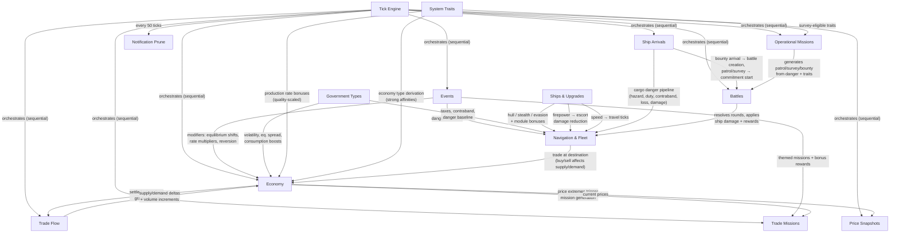

# Stellar Trader — Functional Specification

Master specification for the game. Describes what the game does, how systems connect, and links to detailed design docs. No code — for implementation details see `CLAUDE.md`.

---

## Game Overview

Browser-based multiplayer space trading simulation. Players navigate a network of star systems, trade goods between markets, complete delivery missions, and grow their wealth. The game world features a living economy that evolves independently through tick-based simulation, disrupted by dynamic events.

### Core Loop

```
Travel → Discover → Trade / Fight → Profit → Upgrade → Repeat
```

Players move ships between star systems, buy goods where they're cheap (surplus), sell where they're expensive (deficit), complete delivery missions for guaranteed rewards, and take on operational missions (patrols, surveys, bounty hunts) for combat and exploration. Events disrupt markets, creating new opportunities and dangers.

---

## Active Systems

These systems are implemented and functional. Each has a detailed design doc.

### Universe & Map — [detailed spec](./design/active/universe.md)
Configurable universe scale controlled by `UNIVERSE_SCALE` env var — currently supports up to ~10,000 systems across 60 regions in a 25,000×25,000 map, with the goal of scaling as high as possible. Systems are connected by jump lanes forming a navigable graph. Each region has a government type and a dominant economy label. The map uses a WebGL canvas (Pixi.js) with a two-tier rendering pipeline: a point cloud shows all systems as dots at universe zoom, while tile-based viewport loading fetches detailed system data only for visible tiles at close zoom. A LOD engine crossfades between tiers — zoomed out shows the point cloud, Voronoi-derived region boundaries, fleet presence dots, and region name labels; zooming in progressively reveals system names, economy badges, ship counts, event indicators, and connection fuel costs. Gateway systems serve as chokepoints for inter-region travel.

### System Traits — [detailed spec](./design/active/system-traits.md)
Every system has 2–4 traits (physical properties — asteroid belts, habitable worlds, precursor ruins, gravitational anomalies, etc.) with quality tiers (1–3). 45+ traits across 5 categories (planetary, orbital, resource, phenomena, legacy) with per-economy-type affinity scores. Economy type (agricultural, extraction, refinery, industrial, tech, core) is derived bottom-up by summing strong (value 2) affinities scaled by quality — no direct assignment, no region biasing. The first trait roll is guaranteed to have a strong affinity so every system has a clear economic signal. Trait quality scales production modifiers per good, modifies danger baselines, gates survey missions, and influences event spawning. The faction-facing extensions (economy nudge on conquest, facility placement, war targets) live in the planned [Facilities](./design/planned/facilities.md) doc.

### Economy — [detailed spec](./design/active/economy.md)
12 goods in 3 tiers (raw, processed, advanced) traded at station markets. Prices emerge from supply/demand ratios. Markets drift toward equilibrium through mean reversion, modified by production/consumption flows, random noise, event modifiers, government effects, and system trait production bonuses. Each economy type specializes in producing certain goods and consuming others, creating natural trade routes. Trait quality scales production rates — a tier-3 asteroid belt system produces significantly more ore than a tier-1.

### Trade Simulation (Edge Flow) — [detailed spec](./design/active/trade-simulation.md)
Goods flow along jump-lane edges driven by local price gradients, supplying the inter-system trade pressure player density alone cannot. No merchant entities — the simulator applies the same supply/demand bookkeeping a player trade would, and writes to the same volume accumulator used by the prosperity multiplier. Runs one region per tick in round-robin order, with player activity scaling edge flow back via wall-clock displacement so the simulator stays out of the way in busy regions. Flow events feed a map overlay and a per-system "Trade Activity" panel (top imports/exports, volume sparkline) — routes are inferred from the event log, not stored.

### Events — [detailed spec](./design/active/events.md)
11 primary event types (war, plague, trade festival, mining boom, supply shortage, pirate raid, solar storm, refugee crisis, trade embargo, tech breakthrough, asteroid strike) plus 3 child events that spread from parents. Events spawn randomly, progress through multi-phase arcs, apply modifiers to markets and navigation danger, and spread to neighboring systems. Each phase has distinct economic and danger effects.

### Trading & Missions — [detailed spec](./design/active/trading.md)
Players buy and sell goods at station markets. Prices update dynamically based on supply/demand. Trade missions are auto-generated delivery contracts — import missions at high-price systems, export missions at low-price systems, and event-themed missions during active events. Missions reward credits on delivery plus the goods' sale value.

### Navigation & Fleet — [detailed spec](./design/active/navigation.md)
Travel along jump-lane connections. Travel time scales with the ship's `speed` stat (faster ships = fewer ticks). Ships can be grouped into convoys for collective travel and trade; the convoy moves at the slowest member's speed and all members contribute firepower to a shared escort pool. On arrival, cargo passes through a 5-stage danger pipeline: hazard incidents, import duty, contraband inspection, event-based cargo loss, and hull/shield damage. Hull at 0 disables a ship (cargo lost, needs repair). Shields regenerate on dock.

### Ships — [detailed spec](./design/active/ship-roster.md)
12 ship classes across 3 sizes (small, medium, large) and 5 roles (trade, combat, scout, stealth, support). Each ship has 10 stats (cargo, fuel, speed, hull, shield, firepower, evasion, stealth, sensors, crew). Size sets the baseline profile — small ships are nimble and stealthy with low cargo/hull; large ships haul and absorb damage but can't hide or dodge. Three pipeline stages read ship stats directly: hull reduces hazard loss severity, stealth reduces contraband inspection chance, evasion reduces event cargo-loss probability. Escort firepower in convoys reduces arrival damage with diminishing returns.

### Ship Upgrades — [detailed spec](./design/active/ship-upgrades.md)
Modular slot system. Each ship has a fixed layout of typed slots (engine, cargo, defence, systems) summing to 2–5 total. 12 modules (3 per slot type) — some are tiered stat boosts (Mk I/II/III), others are flat capability unlocks (hidden compartment, manoeuvring thrusters, point defence, scanner array). Modules stack additively or multiplicatively into a single bonus bundle that feeds the danger pipeline and ship stats. Installed at any system today; drydock tier gating is deferred. `[PENDING: facilities]`

### Operational Missions & Combat — [combat spec](./design/active/combat.md)
Three non-trade mission types: **Patrol** (reduce system danger), **Survey** (gather data from trait-rich systems), and **Bounty** (fight pirate encounters). Missions are generated by tick processor based on system danger levels (patrol, bounty) and system traits (survey). Ships must meet stat gates (firepower, sensors, hull) to accept missions. Patrol and survey missions commit the ship for a timed duration. Bounty missions trigger a tick-based battle on arrival — simultaneous damage resolution every 6 ticks with strength/morale tracking, variance, and morale cascades. Battle outcomes (victory, defeat, retreat) apply hull damage and credit rewards. A battle viewer shows live strength bars, morale state, and round history.

### Tick Engine — [detailed spec](./design/active/tick-engine.md)
Game clock advancing every 5 seconds. 9 processors run sequentially in topological order: ship arrivals, events, economy, trade flow, trade missions, op missions, battles, price snapshots, notification prune. Each declares its dependencies and an optional frequency (e.g. price snapshots every 20 ticks, notification prune every 50). Economy and trade flow both process one region per tick (round-robin). All processors execute inside a single transaction — if one fails, the tick counter does not advance. Results are broadcast to clients via SSE with per-player event filtering.

### Auth & Players
User registration and login via NextAuth (JWT/Credentials). Each user has one player profile with credits and a fleet of ships. New players spawn at a core-economy system in the region closest to the map center with a starter Shuttle.

---

## System Interaction Map

How the active systems connect and affect each other:


```mermaid
flowchart TD
    TE[Tick Engine]
    SA[Ship Arrivals]
    BT[Battles]
    EV[Events]
    EC[Economy]
    TF[Trade Flow]
    TM[Trade Missions]
    OM[Operational Missions]
    NF[Navigation & Fleet]
    SH[Ships & Upgrades]
    GOV[Government Types]
    TR[System Traits]
    PS[Price Snapshots]
    NP[Notification Prune]

    TE -- "orchestrates (sequential)" --> SA
    TE -- "orchestrates (sequential)" --> BT
    TE -- "orchestrates (sequential)" --> EV
    TE -- "orchestrates (sequential)" --> EC
    TE -- "orchestrates (sequential)" --> TF
    TE -- "orchestrates (sequential)" --> TM
    TE -- "orchestrates (sequential)" --> OM
    TE -- "orchestrates (sequential)" --> PS
    TE -- "every 50 ticks" --> NP

    EV -- "modifiers: equilibrium shifts,<br/>rate multipliers, reversion" --> EC
    EV -- "danger modifiers" --> NF
    EV -- "themed missions + bonus rewards" --> TM

    EC -- "settled prices feed<br/>gradient calc" --> TF
    EC -- "price extremes trigger<br/>mission generation" --> TM
    EC -- "current prices" --> PS

    TF -- "supply/demand deltas<br/>+ volume increments" --> EC

    GOV -- "volatility, eq. spread,<br/>consumption boosts" --> EC
    GOV -- "taxes, contraband,<br/>danger baseline" --> NF

    TR -- "production rate bonuses<br/>(quality-scaled)" --> EC
    TR -- "economy type derivation<br/>(strong affinities)" --> EC
    TR -- "survey-eligible traits" --> OM

    SH -- "hull / stealth / evasion<br/>+ module bonuses" --> NF
    SH -- "firepower → escort<br/>damage reduction" --> NF
    SH -- "speed → travel ticks" --> NF

    SA -- "cargo danger pipeline<br/>(hazard, duty, contraband, loss, damage)" --> NF
    SA -- "bounty arrival → battle creation,<br/>patrol/survey → commitment start" --> BT

    BT -- "resolves rounds, applies<br/>ship damage + rewards" --> NF

    NF -- "trade at destination<br/>(buy/sell affects supply/demand)" --> EC

    OM -- "generates patrol/survey/bounty<br/>from danger + traits" --> BT
```

Key interactions:
- **Events → Economy**: Event modifiers shift market equilibrium, multiply production/consumption rates, dampen price reversion
- **Events → Navigation**: Danger modifiers increase cargo loss risk on ship arrival
- **Events → Trade Missions**: Active events generate themed delivery contracts with bonus rewards
- **Economy → Trade Flow**: Trade flow reads each region's prices *after* economy has settled them this tick, so gradients reflect current production/consumption state
- **Trade Flow → Economy**: Each flow writes the same supply/demand deltas and volume accumulator increments a player trade would — booming/stagnant prosperity multipliers respond to edge flow exactly like player traffic
- **Economy → Trade Missions**: Price extremes (>2x or <0.5x base) trigger mission generation
- **System Traits → Operational Missions**: Systems with survey-eligible traits (precursor_ruins, gravitational_anomaly, etc.) generate survey missions
- **Danger Levels → Operational Missions**: High-danger systems generate patrol and bounty missions. Enemy tier scales with danger
- **Ship Arrivals → Battles**: Bounty mission ships arriving at target system trigger battle creation. Patrol/survey ships begin their timed commitment
- **Government → Economy**: Volatility scaling, equilibrium spread adjustment, consumption boosts
- **Government → Navigation**: Tax rates, contraband lists, inspection modifiers, danger baseline
- **System Traits → Economy**: Trait quality scales production rates per good. Economy type is derived from trait strong affinities at generation
- **Ships → Navigation**: Hull, stealth, and evasion stats (plus matching upgrade modules) modify danger pipeline outcomes through diminishing returns. Convoy firepower feeds escort damage reduction. Speed determines transit duration
- **Tick Engine → All**: Orchestrates processor execution order and broadcasts results via SSE

---

## Planned Systems

Future systems are designed in `docs/design/planned/`. Each doc is a self-contained spec for a system that layers over the active implementation. See `docs/design/MIGRATION-NOTES.md` for the implementation roadmap and what changes in the active systems when each planned system ships.

---

## Design Doc Workflow

Design docs follow a lifecycle:

1. **Planned** (`docs/design/planned/`): Fully designed, not yet implemented. Source of truth for what will be built.
2. **Active** (`docs/design/active/`): Implemented and functional. Source of truth for what the game currently does. Updated when implementation changes.
3. **Archive** (`docs/design/archive/`): Historical design docs. Kept for reference but may be outdated.

When implementing a planned feature:
1. Complete and finalize the design doc
2. Implement the feature
3. Update the design doc to reflect any implementation changes
4. Move from `planned/` to `active/`
5. Update this SPEC.md to reflect the new system

### `[PENDING: <system>]` marker

When an active spec promotes a partially-implemented feature, deferred sub-features are tagged inline with `[PENDING: <system-name>]`. The token names the gating system (e.g. `faction-system`, `facilities`, `automation`, `war-system`, `combat-destruction`, `hull-regen-processor`, `design-call`). Find all of them with:

```
grep -rn "\[PENDING:" docs/design/active/ docs/SPEC.md
```

When the gating system ships, scan the codebase for its pending tag, implement the deferred items, and remove the marker.
