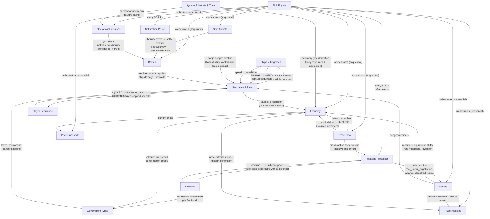

# Stellar Trader — Functional Specification

Master specification for the game. Describes what the game does, how systems connect, and links to detailed design docs. No code — for implementation details see `CLAUDE.md`.

---

## Game Overview

Browser-based multiplayer space trading simulation. Players navigate a network of star systems, trade goods between markets, complete delivery missions, and grow their wealth. The game world features a living economy that evolves independently through tick-based simulation, disrupted by dynamic events.

### Core Loop

```
Travel → Discover → Trade / Fight → Profit → Upgrade → Repeat
```

Players move ships between star systems, buy goods where they're cheap (surplus), sell where they're expensive (deficit), complete delivery missions for guaranteed rewards, and take on operational missions (patrols, surveys, bounty hunts) for combat and exploration. Events disrupt markets, creating new opportunities and dangers.

---

## Active Systems

These systems are implemented and functional. Each has a detailed design doc.

### Universe & Map — [detailed spec](./active/gameplay/universe.md)
Configurable universe scale controlled by `UNIVERSE_SCALE` env var — currently supports up to ~10,000 systems across 60 regions in a 25,000×25,000 map, with the goal of scaling as high as possible. Systems are connected by jump lanes forming a navigable graph. Each system belongs to one faction (which sets its government type) and one region (which contributes a `dominantEconomy` label for orientation). The map uses a WebGL canvas (Pixi.js) with a two-tier rendering pipeline: a point cloud shows all systems as dots at universe zoom, while tile-based viewport loading fetches detailed system data only for visible tiles at close zoom. A LOD engine crossfades between tiers — zoomed out shows the point cloud, Voronoi-derived region boundaries, fleet presence dots, and region name labels; zooming in progressively reveals system names, economy badges, ship counts, event indicators, and connection fuel costs. A map-mode toggle paints the territory polygons by faction (default), by region, by a cold→warm per-system **prosperity** choropleth, or hides them entirely; an additive trade-flow overlay sits on top of any mode, and the price overlay (a per-system halo) carries a buy/sell sub-toggle and can ride on top of the prosperity choropleth (price uses a green↔red deal-quality ramp, kept disjoint from the cold↔warm prosperity ramp). Gateway systems serve as chokepoints for inter-region travel. Data loading at this scale and per-player fog-of-war visibility are detailed in [map-data-loading](./active/engineering/map-data-loading.md).

### System Substrate & Traits — [detailed spec](./active/gameplay/system-traits.md)
Every system is built from a physical substrate — a sun (its class gates composition), 1–N bodies (planets, asteroid belts, gas giants) each carrying a resource vector over seven resource types, and rare richness modifiers that multiply a body's resource — plus 0–2 narrative features. Economy type (agricultural, extraction, refinery, industrial, tech, core) is derived bottom-up from the system's aggregate body resources and population — no direct assignment, no region biasing. Features (precursor ruins, anomalies, derelict fleets, etc.) carry no economic role: they have quality tiers (1–3), modify danger baselines, gate survey/salvage/recon missions and exploration sites, and influence event spawning. The faction-facing extensions (economy nudge on conquest, facility placement, war targets) live in the planned [Facilities](./planned/facilities.md) doc.

### Economy — [detailed spec](./active/gameplay/economy.md)
12 goods in 3 tiers (raw, processed, advanced) traded at station markets. Prices emerge from a single stock value per market via a pricing-anchor curve, with intra-trade slippage and a bid-ask spread that make same-station round-trips unprofitable. Stock evolves through self-limiting production/consumption, random noise, event modifiers, and government effects — equilibrium emerges from production/consumption balance plus spatial trade flow, with no mean-reversion and no separate demand axis. Production and consumption derive directly from each system's physical substrate — resource-driven production for raw goods (deposits × labour), universal population-scaled consumption — creating natural trade routes from resource-rich worlds to populous ones. Economy type is a derived display label, not an input to the tick. A per-system **prosperity** value (crisis → booming) scales production and consumption together; it surfaces as a label badge on the system Overview and Market screens and as the map's prosperity choropleth.

### Trade Simulation (Edge Flow) — [detailed spec](./active/gameplay/trade-simulation.md)
Goods flow along jump-lane edges driven by local price gradients, supplying the inter-system trade pressure player density alone cannot. No merchant entities — the simulator applies the same single stock delta a player trade would, and writes to the same volume accumulator used by the prosperity multiplier. Flow is bounded by **faction** borders, not regions: goods cross an edge only when both endpoints share a faction (region lines ignored, sovereign borders closed), and each edge's flow is distance-attenuated by its fuel cost. The processor sweeps a fixed work-budget slice of the open-edge graph each tick — decoupling per-tick work from faction-territory size — with per-edge player activity scaling that edge's flow back via wall-clock displacement so the simulator stays out of the way where players trade. Flow events feed a map overlay and a per-system "Trade Activity" panel (top imports/exports, volume sparkline) — routes are inferred from the event log, not stored.

### Events — [detailed spec](./active/gameplay/events.md)
12 primary event types (inner_system_conflict, plague, trade_festival, mining_boom, ore_glut, supply_shortage, pirate_raid, solar_storm, refugee_crisis, trade_embargo, tech_breakthrough, asteroid_strike), 2 child events that spread from parents (conflict_spillover, plague_risk), and 3 relations-owned event types spawned exclusively by the relations processor (border_conflict, pact_under_negotiation, alliance_dissolved — see Inter-Faction Relations below). Events spawn randomly (weighted by government type), progress through multi-phase arcs, apply modifiers to markets and navigation danger, and spread to neighboring systems. Each phase has distinct economic and danger effects.

### Trading & Missions — [detailed spec](./active/gameplay/trading.md)
Players buy and sell goods at station markets. Prices update dynamically based on each good's stock. Trade missions are auto-generated delivery contracts — import missions at high-price systems, export missions at low-price systems, and event-themed missions during active events. Missions reward credits on delivery plus the goods' sale value.

### Navigation & Fleet — [detailed spec](./active/gameplay/navigation.md)
Travel along jump-lane connections. Travel time scales with the ship's `speed` stat (faster ships = fewer ticks). Ships can be grouped into convoys for collective travel and trade; the convoy moves at the slowest member's speed and all members contribute firepower to a shared escort pool. On arrival, cargo passes through a 5-stage danger pipeline: hazard incidents, import duty, contraband inspection, event-based cargo loss, and hull/shield damage. Hull at 0 disables a ship (cargo lost, needs repair). Shields regenerate on dock.

### Ships — [detailed spec](./active/gameplay/ship-roster.md)
12 ship classes across 3 sizes (small, medium, large) and 5 roles (trade, combat, scout, stealth, support). Each ship has 10 stats (cargo, fuel, speed, hull, shield, firepower, evasion, stealth, sensors, crew). Size sets the baseline profile — small ships are nimble and stealthy with low cargo/hull; large ships haul and absorb damage but can't hide or dodge. Three pipeline stages read ship stats directly: hull reduces hazard loss severity, stealth reduces contraband inspection chance, evasion reduces event cargo-loss probability. Escort firepower in convoys reduces arrival damage with diminishing returns.

### Ship Upgrades — [detailed spec](./active/gameplay/ship-upgrades.md)
Modular slot system. Each ship has a fixed layout of typed slots (engine, cargo, defence, systems) summing to 2–5 total. 12 modules (3 per slot type) — some are tiered stat boosts (Mk I/II/III), others are flat capability unlocks (hidden compartment, manoeuvring thrusters, point defence, scanner array). Modules stack additively or multiplicatively into a single bonus bundle that feeds the danger pipeline and ship stats. Installed at any system today; drydock tier gating is deferred. `[PENDING: facilities]`

### Operational Missions & Combat — [combat spec](./active/gameplay/combat.md)
Three non-trade mission types: **Patrol** (reduce system danger), **Survey** (gather data from trait-rich systems), and **Bounty** (fight pirate encounters). Missions are generated by tick processor based on system danger levels (patrol, bounty) and system traits (survey). Ships must meet stat gates (firepower, sensors, hull) to accept missions. Patrol and survey missions commit the ship for a timed duration. Bounty missions trigger a tick-based battle on arrival — simultaneous damage resolution every 6 ticks with strength/morale tracking, variance, and morale cascades. Battle outcomes (victory, defeat, retreat) apply hull damage and credit rewards. A battle viewer shows live strength bars, morale state, and round history.

### Factions — [detailed spec](./active/gameplay/faction-system.md)
The political layer. 8 major factions plus minor factions (12 at default scale, 18 at 10K) own the universe — every star system has a `factionId`. Each faction has a government type (one of 8: federation, corporate, authoritarian, frontier, cooperative, technocratic, militarist, theocratic) that drives its economic identity, and a doctrine (one of 5: expansionist, protectionist, mercantile, hegemonic, opportunistic) that drives political behaviour. Government type sourced per-system from the owning faction (no longer per-region). Faction status (dominant / major / regional / minor) is derived from share of total factioned systems with hysteresis at the boundaries — scale-independent, so the same thresholds work at 600 and 10K. Minors are placed at world-gen by four archetypes (buffer, frontier, enclave, cluster) and protected by a 5-system floor. Faction overview UI lists factions with a detail page showing territory sample, doctrine, government, relations, alliances, recent border conflicts, and your own reputation.

### Inter-Faction Relations — [detailed spec](./active/gameplay/faction-system.md#2-inter-faction-relations)
Per-pair score (-100 to +100) drifts every 3 ticks via a dedicated relations processor. Drift drivers: a constant negative baseline ("peace needs maintenance"), border friction (cross-faction jump lanes), doctrine compatibility, sparse government opposition, common-enemy bonus, recent trade volume, active-alliance maintenance, and alliance-with-enemy penalty. Five tiers (allied +75 / friendly +25 / neutral / unfriendly -25 / hostile -75). The processor spawns `border_conflict` events (one active per pair, three phases applying danger and production modifiers) when a pair drops to ≤-25, telegraphs alliance formation via `pact_under_negotiation` events (5–10 tick negotiation window, must hold ≥+60 to confirm), and dissolves alliances below +50 via `alliance_dissolved` events. Pact records and per-pair history (last 10 drift entries) are stored.

### Player-Faction Reputation — [detailed spec](./active/gameplay/faction-system.md#3-player-faction-reputation)
Per-player, per-faction score (-100 to +100) bootstrapped at 0 across every faction on registration. Earned through trading at faction-owned markets (+0.5 per successful trade, capped at +2.0 per faction per tick to prevent grind-spam). Drives transaction multipliers on buy/sell (Champion ×0.92/×1.08, Trusted ×0.96/×1.04, Neutral ×1.0, Distrusted ×1.08/×0.92, Hostile denied entirely). Market prices remain universal — reputation modifies the player's individual transaction, not the displayed price, so it stacks naturally with government modifiers and event modifiers without collision. Reputation panel surfaces all standings per player.

### Tick Engine — [detailed spec](./active/engineering/tick-engine.md)
Game clock advancing every 5 seconds. 10 processors run sequentially in topological order: ship arrivals, events, economy, trade flow, trade missions, op missions, battles, relations (every 3 ticks, depends on events), price snapshots, notification prune. Each declares its dependencies and an optional frequency (e.g. price snapshots every 20 ticks, notification prune every 50). Economy processes one region per tick (round-robin); trade flow sweeps a work-budget slice of the intra-faction edge graph each tick (region-independent); relations processes all faction pairs each time it runs. All processors execute inside a single transaction — if one fails, the tick counter does not advance. Results are broadcast to clients via SSE with per-player event filtering.

### Notifications & Captain's Log — [detailed spec](./active/gameplay/notifications.md)
Per-player notifications for things that happen to your own assets — ship arrivals, damage/disable, cargo loss, battle outcomes, mission completion/expiry, import duties, contraband seizure — distinct from ambient world events. Surfaced two ways: a sidebar bell with an unread badge and recent feed, and the Captain's Log (a full searchable, filterable, paginated history). Persisted server-side so offline players catch up; a tick processor prunes entries older than 500 ticks.

### Auth & Players
User registration and login via NextAuth (JWT/Credentials). Each user has one player profile with credits and a fleet of ships. New players spawn at the `GameWorld.startingSystemId` — currently a core-economy system in a Federation-government major's territory near the map center — with a starter Shuttle. A `PlayerFactionReputation` row is created for every faction at the same time, all at score 0; players are not faction-aligned at creation.

---

## System Interaction Map

How the active systems connect and affect each other:


```mermaid
flowchart TD
    TE[Tick Engine]
    SA[Ship Arrivals]
    BT[Battles]
    EV[Events]
    EC[Economy]
    TF[Trade Flow]
    TM[Trade Missions]
    OM[Operational Missions]
    REL[Relations Processor]
    NF[Navigation & Fleet]
    SH[Ships & Upgrades]
    FA[Factions]
    GOV[Government Types]
    REP[Player Reputation]
    TR["System Substrate & Traits"]
    PS[Price Snapshots]
    NP[Notification Prune]

    TE -- "orchestrates (sequential)" --> SA
    TE -- "orchestrates (sequential)" --> BT
    TE -- "orchestrates (sequential)" --> EV
    TE -- "orchestrates (sequential)" --> EC
    TE -- "orchestrates (sequential)" --> TF
    TE -- "orchestrates (sequential)" --> TM
    TE -- "orchestrates (sequential)" --> OM
    TE -- "every 3 ticks,<br/>after events" --> REL
    TE -- "orchestrates (sequential)" --> PS
    TE -- "every 50 ticks" --> NP

    EV -- "modifiers: equilibrium shifts,<br/>rate multipliers, reversion" --> EC
    EV -- "danger modifiers" --> NF
    EV -- "themed missions + bonus rewards" --> TM

    EC -- "settled prices feed<br/>gradient calc" --> TF
    EC -- "price extremes trigger<br/>mission generation" --> TM
    EC -- "current prices" --> PS

    TF -- "stock deltas<br/>+ volume increments" --> EC
    TF -- "cross-faction trade volume<br/>(positive drift driver)" --> REL

    FA -- "per-system government<br/>(via factionId)" --> GOV
    FA -- "doctrine + status<br/>(drift bias, alliance gating)" --> REL

    GOV -- "volatility, eq. spread,<br/>consumption boosts" --> EC
    GOV -- "taxes, contraband,<br/>danger baseline" --> NF

    REL -- "border_conflict /<br/>pact_under_negotiation /<br/>alliance_dissolved events" --> EV
    REL -- "alliance pacts<br/>(future war co-defense)" --> FA

    REP -- "buy/sell multipliers,<br/>hostile trade denial" --> NF

    TR -- "economy type derivation<br/>(body resources + population)" --> EC
    TR -- "survey/salvage/recon<br/>feature gating" --> OM

    SH -- "hull / stealth / evasion<br/>+ module bonuses" --> NF
    SH -- "firepower → escort<br/>damage reduction" --> NF
    SH -- "speed → travel ticks" --> NF

    SA -- "cargo danger pipeline<br/>(hazard, duty, contraband, loss, damage)" --> NF
    SA -- "bounty arrival → battle creation,<br/>patrol/survey → commitment start" --> BT

    BT -- "resolves rounds, applies<br/>ship damage + rewards" --> NF

    NF -- "trade at destination<br/>(buy/sell affects stock)" --> EC
    NF -- "successful trade →<br/>+0.5 rep (capped per tick)" --> REP

    OM -- "generates patrol/survey/bounty<br/>from danger + traits" --> BT
```

Key interactions:
- **Events → Economy**: Event modifiers shift market equilibrium, multiply production/consumption rates, dampen price reversion
- **Events → Navigation**: Danger modifiers increase cargo loss risk on ship arrival
- **Events → Trade Missions**: Active events generate themed delivery contracts with bonus rewards
- **Economy → Trade Flow**: Trade flow runs *after* the economy processor each tick (`dependsOn`), so gradients read the latest settled prices rather than stale ones — including this tick's update to whichever region economy just processed
- **Trade Flow → Economy**: Each flow writes the same stock delta and volume accumulator increments a player trade would — booming/stagnant prosperity multipliers respond to edge flow exactly like player traffic
- **Economy → Trade Missions**: Price extremes (>2x or <0.5x base) trigger mission generation
- **System Traits → Operational Missions**: Systems with survey-eligible traits (precursor_ruins, gravitational_anomaly, etc.) generate survey missions
- **Danger Levels → Operational Missions**: High-danger systems generate patrol and bounty missions. Enemy tier scales with danger
- **Ship Arrivals → Battles**: Bounty mission ships arriving at target system trigger battle creation. Patrol/survey ships begin their timed commitment
- **Government → Economy**: Volatility scaling, equilibrium spread adjustment, consumption boosts
- **Government → Navigation**: Tax rates, contraband lists, inspection modifiers, danger baseline
- **Factions → Government**: Government type is sourced from each system's owning faction (no longer per-region)
- **Factions → Relations**: Doctrine pair and status drive drift bias; status gates alliance capacity (planned)
- **Relations → Events**: The relations processor spawns `border_conflict` (when a pair turns unfriendly), `pact_under_negotiation` (alliance telegraph), and `alliance_dissolved` (warning before pact removal) events. The events processor then applies the danger and production modifiers
- **Trade Flow → Relations**: Cross-faction trade volume is a positive drift driver (capped per drift tick)
- **Navigation → Reputation**: Successful trades at faction-owned markets accrue +0.5 reputation with the owning faction, capped at +2.0 per faction per tick
- **Reputation → Navigation**: Per-faction standing applies a transaction multiplier to buy/sell prices (Champion best, Hostile denies trade) — the displayed market price is unchanged
- **Substrate → Economy**: Production and consumption derive directly from a system's aggregate body resources and population each tick; economy type is a derived display label. Narrative features carry no economic role
- **Ships → Navigation**: Hull, stealth, and evasion stats (plus matching upgrade modules) modify danger pipeline outcomes through diminishing returns. Convoy firepower feeds escort damage reduction. Speed determines transit duration
- **Tick Engine → All**: Orchestrates processor execution order and broadcasts results via SSE

---

## Planned Systems

Future systems are designed in `docs/planned/`. Each doc is a self-contained spec for a system that layers over the active implementation. See `docs/MIGRATION-NOTES.md` for the implementation roadmap and what changes in the active systems when each planned system ships.

---

## Design Doc Workflow

Design docs follow a lifecycle:

1. **Planned** (`docs/planned/`): Fully designed, not yet implemented. Source of truth for what will be built.
2. **Active** (`docs/active/`): Implemented and functional. Source of truth for what the game currently does. Updated when implementation changes.
3. **Archive** (`docs/archive/`): Historical design docs. Kept for reference but may be outdated.

Code-heavy implementation plans live separately in `docs/plans/` (not part of this design-doc lifecycle) and are deleted once their feature ships — the functional spec stays in `active/` and the code is the source of truth.

When implementing a planned feature:
1. Complete and finalize the design doc
2. Implement the feature
3. Update the design doc to reflect any implementation changes
4. Move from `planned/` to `active/`
5. Update this SPEC.md to reflect the new system

### `[PENDING: <system>]` marker

When an active spec promotes a partially-implemented feature, deferred sub-features are tagged inline with `[PENDING: <system-name>]`. The token names the gating system (e.g. `faction-system`, `facilities`, `automation`, `war-system`, `combat-destruction`, `hull-regen-processor`, `design-call`). Find all of them with:

```
grep -rn "\[PENDING:" docs/active/ docs/SPEC.md
```

When the gating system ships, scan the codebase for its pending tag, implement the deferred items, and remove the marker.
