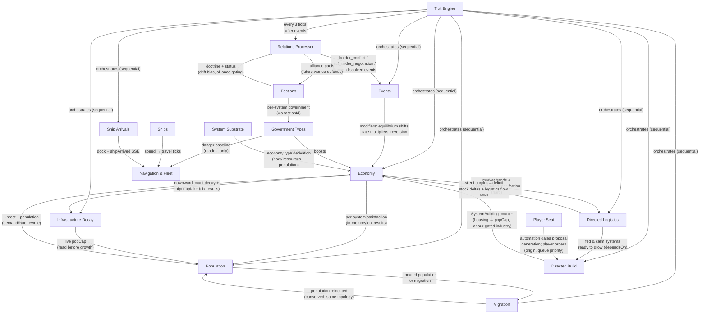

# Functional Specification

Master specification for the game. Describes what the game does, how systems connect, and links to detailed design docs. No code — for implementation details see `CLAUDE.md`.

> **⚙ Re-conception in progress.** The game is a **single-player grand-strategy game** — a
> single-player, in-memory, no-login simulation of a living galaxy with the full map ([runtime
> spec](./active/engineering/single-player-runtime.md)). It is being re-conceived from a browser-based
> multiplayer space-trading game; the roadmap and design pillars are in
> [grand-strategy-vision.md](./planned/grand-strategy-vision.md). The Active Systems below describe the
> game as it works today; features still on the roadmap (the player seat, fog of war, war) are marked
> **planned**.

---

## Game Overview

Single-player grand-strategy game (working title pending — "Stellar Trader" no longer describes it). The player rules a spacefaring faction in a procedurally generated galaxy: starting from a small developed core, they colonise open space, develop worlds under real physical constraints (deposits, space, habitability, labour), steer a living simulated economy with population, unrest, migration, and logistics, and — eventually — convert economic strength into military power against AI factions running the same machinery. EU5-style control: everything is directly controllable and everything is automatable per domain. Design pillars and phasing in [grand-strategy-vision.md](./planned/grand-strategy-vision.md).

### Core Loop

```
Colonise → Develop → Supply → Specialise → Project power → Repeat
```

The player allocates each world's finite space between extraction, industry, and habitation (fractional magnitudes, not building slots), keeps their systems fed and calm through a logistics network whose effectiveness they invest in, specialises worlds into an interdependent economy, and grows population and industry toward the physical ceilings of their territory. Events perturb the physical world; unrest, migration, and decay punish neglect. War (deferred, designed) makes the economy's stakes lethal.

---

## Active Systems

These systems are implemented and functional. Each has a detailed design doc.

### Universe & Map — [detailed spec](./active/gameplay/universe.md)
Universe size is chosen per game on the New-game screen — a system count (Zod-validated 50–20,000, default 600) from which region count, spacing, and map extent are derived continuously (the 600-system default is a ~7,000-unit map, ~10,000 systems a ~25,000-unit map). Map extent lives in generated world state (`meta.mapSize`, read from the atlas), not an env var. Systems are connected by jump lanes forming a navigable graph. Each faction starts as a single developed homeworld in an otherwise-unclaimed galaxy and grows each month by claiming nearby unclaimed systems (`controlled`) and developing its controlled systems (`developed`) — ownership is a three-state system `control` flag, not a building; a system's owning faction (when it has one) sets its government type, and every system belongs to one region (which contributes a `dominantEconomy` label for orientation). The map uses a WebGL canvas (Pixi.js) with a two-tier rendering pipeline: a point cloud shows all systems as dots at universe zoom, while tile-based viewport loading fetches detailed system data only for visible tiles at close zoom. A LOD engine crossfades between tiers — zoomed out shows the point cloud, Voronoi-derived region boundaries, and region name labels; zooming in progressively reveals system names, economy badges, and connection fuel costs. A map-mode toggle selects what the territory layer paints: **political** (faction ownership, default), **regions**, one of four **value choropleths** — **stability** (the inverse of `unrest` — high unrest = low stability), **population**, **development**, or **migration** (per-system attractiveness — the *pull*, reusing `migrationAttractiveness`) — or **none**. The **magnitude** value modes are EU5-style: each cell prints its value as a number (coalescing system → faction-within-region → faction as you zoom out) over a relative gradient normalised to the visible scope, re-scaling to a focused faction's worlds when one is selected; **migration** is colour-only (attractiveness has no natural printed unit) and developed-gated (undeveloped = absent = black). A single additive **logistics** overlay (directed faction hauls, curved convoy arcs) sits on top of any mode. Every system is **selectable at any zoom** by clicking its Voronoi cell (not just the star hitbox); a zoomed-out faction click opens the faction panel and re-scales the value gradient to it. Each system's dot is coloured by its **star type**. Gateway systems serve as chokepoints for inter-region travel. Data loading at this scale is detailed in [map-data-loading](./active/engineering/map-data-loading.md) and the full rendering/selection model in [map-rendering](./active/engineering/map-rendering.md); there is no fog of war — every system is fully visible (per-player, ship-based visibility is planned).

### System Substrate — [detailed spec](./active/gameplay/economy-substrate-v2-available-space.md)
Every system is built from a physical substrate — a sun (its class gates composition), 1–N bodies (planets, asteroid belts, gas giants) each with a finite **available space** (from body size) partitioned into per-resource **deposit slots** (each carrying a poor/average/good/rich **quality band**) and fungible **general space**, whose **habitable fraction** caps population. Economy type (agricultural, extraction, refinery, industrial, tech, core) is derived bottom-up from the system's effective deposit potential (slot caps × quality yields) and population — no direct assignment, no region biasing; the galaxy is **extraction-dominant by design** (raw building blocks are needed in volume, and gas giants with no habitable land are truly dead). The faction-facing extensions (economy nudge on conquest, war targets) will be specced with the pivot's war phase (the old planned Facilities doc is deleted).

### Economy — [detailed spec](./active/gameplay/economy.md)
26 goods in 3 tiers (raw, processed, advanced) traded at station markets. Prices emerge from a single stock value per market via a pricing-anchor curve clamped to a **per-market band** — a demand-derived floor reserve and an infrastructure-derived ceiling (`Σ` building storage), replacing the legacy global `[5, 200]` — read as a single derived spot price; there is no personal buy/sell trading. Stock evolves through self-limiting production/consumption, band-relative noise, event modifiers, and government effects — equilibrium emerges from production/consumption balance plus directed logistics moving goods between systems, with no mean-reversion and no separate demand axis. **Only `developed` systems are economically active**: the economy tick, population, migration, and directed logistics all run on developed systems only (via the shared `isEconomicallyActive` predicate) — unclaimed and controlled systems are inert, their seeded markets frozen and population 0. Production is capacity-driven and **input-gated**: each system has a seeded industrial base (`SystemBuilding` counts built onto the bodies' **available space** — extractors on deposit slots, factories on general space, population centres on habitable space), and per-good output equals `Σ count × outputPerUnit × effectiveFulfilment × inputGate × yield` where `effectiveFulfilment` is the head-count ratio `min(1, population / labour demand)` (population is the labour pool) further gated, for tier-1+ goods, by academy-licensed **skill ceilings** (see Economy Specialisation), `inputGate` throttles a tier-1+ good by the availability of its recipe inputs (1 for tier-0 extractables), and `yield` scales a tier-0 extractable by its deposit quality (1 for tier-1+). The 26 goods form a production chain: tier-1+ buildings draw their recipe inputs from local stock each tick, processed in recipe-topological order per system, so a shortage of any input **cascades** down the chain — cut an input's supply and every downstream good throttles in sequence. Consumption has two channels — universal civilian demand from a per-system **demand basis** (per-capita baseline + per-grade skilled-work consumption baskets — see Economy Specialisation S3) plus the production-input draw — and `demandRate` (the days-of-supply pricing denominator) sums both, so an input-heavy good (a refinery world's Ore) prices honestly rather than cheap-when-scarce. Economy type is a derived display label, not an input to the tick. **Population is dynamic** (Float, grows/declines/migrates): the economy processor records per-good satisfaction (`delivered / demanded`) each tick; the population processor integrates these into `unrest` (0…1), applies logistic growth/decline, and rewrites `demandRate` for the new population and its labour allocation; a migration processor then relocates population along the same intra-faction topology. Chronic unmet demand raises `unrest`; high `unrest` triggers a strike state that smoothly suppresses production (consumption is never suppressed). A per-system **stability** readout (the inverse of `unrest`) surfaces on the map as a choropleth and as a per-system badge, and on the system screen as a Population tab (magnitude, `popCap` utilisation, unrest/stability, strike state, and a pressure-sorted per-good needs ledger — want vs delivered per good) and a stability row on the Overview. **Infrastructure is dynamic too**: `SystemBuilding.count` decays **downward** each economy shard toward what is actively *used* — gentle disuse where built exceeds staffed-and-selling (production/extraction) or occupancy (housing), plus a catastrophic unrest-driven teardown above a threshold — so `popCap` recomputes live from the surviving housing and a failing system sheds its industry; housing rotting below its occupants displaces the overshoot as migration ⊕ death. The **Industry panel** surfaces this per building as available (shared land headroom) · built · in-use, health-coloured (stable / idle / collapsing) …and surfaces the skill-tiered labour model — a system Labour card (workforce + the two academy-licensed skill ceilings), per-building health glyphs, academy-named idle reasons, and per-grade staffing tooltips.

### Open-Edge Topology & Flow Surfaces — [detailed spec](./active/gameplay/trade-simulation.md)
The galaxy moves goods and people along one shared substrate: the **faction-bounded open-edge topology**. An edge is open only when both endpoints share a faction (region lines ignored, sovereign borders closed). **Goods movement is entirely directed logistics** — a faction hauls its own surplus to its own deficits (see Directed Logistics); there is no passive price-gradient diffusion between markets. The same topology carries **population migration** (a parallel flow): population moves down-unrest / up-headroom along the same intra-faction graph, distance-attenuated by fuel cost, so people and goods share one map. Both are gated to developed systems. Each directed haul is recorded in a rolling flow-event log that feeds the **Logistics** map overlay and the per-system **Logistics tab** (imports/exports plus production/consumption and volume history) — routes are inferred from the event log, not stored.

### Directed Logistics & Autonomic Agency — [detailed spec](./active/gameplay/economy-autonomic-agency.md)
The *recovery* counterpart to SP3.5 infrastructure decay: factions deliberately act on their own territory to counter the decay ratchet and feed the suppliable middle of the galaxy. Two mechanisms share one slow agency clock (48 ticks, per-faction shard) and one "supply vs need" reading per system (deficit/surplus against the days-of-supply anchor, with a self-supply gate). **Directed logistics** moves a faction's surplus to its own deficits — the sole goods-mover — greedy nearest-surplus matching within a population-funded work budget (work = quantity × route cost), applied silently as stock deltas plus a `logistics`-tagged `TradeFlow` row, with the budget deliberately below total need so a residual (the negative space) remains. **Autonomic build** grows systems toward viable potential along a strict physical chain — habitable land → housing → population → industry: proactive housing leads (built ahead of population at *fed and calm* systems, capped at habitable land), population fills it, and labour-gated industry follows the resident workforce (a build can only add what already-present population can staff). Industry placement is **demand-rate-driven**: the planner sizes built capacity to close a *rate* deficit (a good's local `production < demand`, with no reachable rate exporter to serve it) rather than to fill a days-of-supply stock target, so extraction grows tier-by-tier as each factory's input draw appears — the stock buffer is a passive shock-absorber, never a build goal. The planner is a clean decision → gate → pacing pipeline (rank rate-deficit opportunities → fit to spare labour/space/whole-levels → the construction pool alone paces the committed queue). The pool is **eligible heads** — population minus heads actually employed in skilled jobs, so an industrialising faction's raw labour throughput erodes as skilled employment grows — substitutable with capital via **Construction Centres**, a non-producing building whose staffed output is priced off the backlog frontier (a construction point is worth the best work the pool can't yet fund) and which competes on the same ROI ordering as any other proposal. Build and decay share one equilibrium (occupied housing, staffed-and-selling industry), so a viable system sits at potential with both ≈ 0. Free and capacity-bounded in this slice — no treasury, no money, no claimable contracts (the player-facing trade layer is a later rework). Logistics-first sequencing is deliberate: supply makes a system viable, and a viable system builds.

### Construction & Colonisation — [detailed spec](./active/gameplay/colonisation.md)
Territorial growth is two ownership steps a month: a cheap, near-instant **claim** (`unclaimed → controlled`) stakes a border, and a pool-funded, timed **develop** (`controlled → developed`) settles a controlled system into a live colony. Developing is a *colony-establish* project drawn from the same per-faction construction pool that builds housing and industry, so expansion competes with build-out on **one ROI axis** — a colony's value is the unmet demand its deposits unblock plus the forward option value of its land (gated by territory saturation) minus the opportunity cost of the population it seeds, ranked directly against build ROIs and funded front-first from the pool (no per-pulse develop cap; a settler-supply gate throttles founding to what the faction can populate). Every completed establish lands a colony **viable by construction** — a tiny conserved seed population plus the housing to hold it, so `popCap` never welds to a stranded seed. Colonies then bootstrap from a two-person spark: **routed colonist delivery** water-fills spare population from the cores out to the emptiest frontier, **fullness-gated migration** lets an empty colony draw settlers ahead of its jobs (whose consumption pulls the industry that staffs them), and proactive housing leads population so the cap grows as it fills. The galaxy starts from these cores — each faction capital is stamped with an identical self-sufficient **home-system prefab**, every other system an empty deposit field expansion colonises into. For the player's faction, both halves are also directly directable — see Player Seat below.

The committed-construction queue (`world.constructionProjects` — industry `build` levels and `colony_establish` projects, each carrying an `origin: "auto" | "player"`) surfaces tick-live on two screens. The system **Overview** carries a **Construction** vital tile (open-project count, linking to Industry) on any developed system, and — on a controlled, not-yet-developed player system — the colonisation founding entry (establish verb + preview, the forming project, or the disabled verb with its blocking reason). The system **Industry** tab renders every in-flight build as a **ghost row inside the ledger group it will join** (extractors under their deposit, everything else under its Housing/Academies/Specialisation/Production/Support heading), with an exact progress bar, funding rate, and a coarse ETA (`fundQueue` forward-simulated at the current pool — the bar/percent is exact, the ETA an estimate). The faction **construction command card** rolls the whole faction's queue into pool composition (base + Construction Centre share) and two link lists — systems building, colonies forming — each linking to its system's Industry tab; the player's own card additionally carries the automation switch pair. One pure readout (`computeFactionConstruction`) feeds every surface. All are tick-invalidated on the monthly economy pulse.

### Player Seat — Control & Construction Verbs — [detailed spec](./active/gameplay/player-seat.md)
The player's faction runs the same autonomic brain as every AI faction, with a control surface layered on top. **Per-domain automation switches** (`world.player.automation.build` / `.colonisation`, both default on) gate the directed-build planner's *proposal generation* for the player's faction only — turning one off stops new autonomic proposals in that domain while already-committed funding and manual orders continue unaffected; AI factions never read the field. **Manual verbs** — order a build (quick-add `+` on any Industry-tab ledger row, or a new-industry dialog for a type with no row yet), direct a colony (an Establish verb + preview on a controlled system's Overview, same eligibility and sizing the planner itself uses), and cancel (player rows only; spent work is lost) — write into the same `world.constructionProjects` queue as autonomic proposals, tagged `origin: "player"`. **Queue priority** (`orderOpenProjects`) is a stable partition — committed work first, then fresh player orders, then new autonomic proposals — that is an identity on any queue with no player rows, so the playerless calibration harness is unaffected. **Feasibility** (`computeBuildOptions`) is one shared computation: space/deposit-slot ceilings are hard rejections everywhere the planner itself respects; a labour/staffing shortfall is a warning, never a block — the player may overbuild what their population can staff, and staffing dilution + idle-decay punish that choice honestly.

### Economy Specialisation — Skill-Tiered Labour — [detailed spec](./active/gameplay/economy-specialisation.md)
Manufacturing's specialisation gate (stage **S1** of a four-stage track). A good's staffing is a per-good 3-grade vector `(unskilled, skill1, skill2)` that **partitions** its head count; two **academy** buildings — a vocational school (skill-1) and a research institute (skill-2) — raise a *ceiling* on how much of the existing population may work each skilled grade (population stays a single scalar — skill is not a kind of person). Per-good output is gated by `effectiveFulfilment(tier)` = the head-count ratio min'd with the skill-fulfilment ratios (`skillCap / skillDemand`) the good's tier draws on, so a frontier world with **no academy physically cannot run tier-1+ manufacturing**, and a tech hub must sink space + population into academies (and so can't also be broad → it imports the rest). Academies eat general space, draw unskilled labour, decay toward the skill demand they actually serve, and are **co-built by the autonomic planner** as a buildable labour gate when a skill ceiling blocks a deficit-serving build. Per-good general-space `spaceCost` differentiates factory footprints (shipyards/foundries are large). Stages S2 (specialisation complexes) and S3 (demand concentration) are shipped — see the next sections; stage S4 (guardrails) remains planned — see the [track vision](./planned/economy-specialisation.md).

### Economy Specialisation — Specialisation Complexes — [detailed spec](./active/gameplay/economy-specialisation-s2-complexes.md)
Manufacturing's comparative advantage (stage **S2** of the track). Five production **families** partition the 18 tier-1+ goods (heavy industry, chemicals, electronics, armaments, consumer goods); each family has one **specialisation complex** — a non-producing anchor building (large general-space footprint, small unskilled staffing, **capped at one complex per system across all families** — "one industrial identity") whose presence multiplies the *yield* of every family good produced there, linearly up to one full complex. The buff folds into `buildingProduction`, so production, input demand, and the read services inherit it with no separate read path. Complexes decay toward the family throughput they actually buff (rated coverage), are seeded at each system's dominant family where projected throughput clears a floor, and are **co-built by the autonomic planner** exactly as academies are — charged to the same deficit-serving opportunity. Family goods score at their buffed per-unit, so an anchored site out-ranks a greenfield rival and production concentrates structurally (the snowball) — arresting the price-flattening a matured galaxy otherwise settles into. Nothing is restricted: the complex's footprint physically crowds out breadth. The Industry panel renders complexes as their own Specialisation group; tooltips list the family's goods and the current yield multiplier. Magnitudes are coarse first-cut, tuned in the single S1–S4 calibration pass.

### Economy Specialisation — Development-Tiered Demand — [detailed spec](./active/gameplay/economy-specialisation-s3-demand.md)
Demand's specialisation gradient (stage **S3** of the track). Civilian consumption derives from a per-system **demand basis** `{population, technicians, engineers}` instead of bare population: skilled work *actually performed* (from `computeLabourAllocation` — bounded by jobs, academy licence, and headcount, so a hub that loses its industry sheds the discretionary demand with it) adds per-grade **consumption baskets** on top of the flat per-capita baseline — the technician basket consumer_goods-dominant, the engineer basket luxuries-dominant with luxuries engineer-exclusive. Basics are never reduced; development only *adds* demand, so developed hubs become the galaxy's big discretionary importers exactly where S1/S2 space+labour scarcity stops broad self-supply — demand concentrates where supply can't (the signal derives from buildings + population only; no feedback circularity with satisfaction or unrest). Threaded through the single `consumptionRate` chokepoint so pricing, satisfaction weights, seed, and the tick adapters all inherit it; the Labour card's skill chips list each grade's basket, and Population-panel demand rows carry a base/technicians/engineers composition tooltip. Magnitudes are coarse first-cut, tuned in the single S1–S4 calibration pass.

### Events — [detailed spec](./active/gameplay/events.md)
12 primary event types (inner_system_conflict, plague, trade_festival, mining_boom, ore_glut, supply_shortage, pirate_raid, solar_storm, refugee_crisis, trade_embargo, tech_breakthrough, asteroid_strike), 2 child events that spread from parents (conflict_spillover, plague_risk), and 3 relations-owned event types spawned exclusively by the relations processor (border_conflict, pact_under_negotiation, alliance_dissolved — see Inter-Faction Relations below). Events spawn randomly (weighted by government type), progress through multi-phase arcs, apply modifiers to markets, and spread to neighboring systems. Each phase has distinct economic effects.

### Market Inspection
The market screen is a read-only inspection surface: per-system current prices, stock levels, and a cross-system price comparison (heatmap overlay + comparison panel). Prices update dynamically based on each good's stock via the economy tick. There is no personal buy/sell trading — goods move through directed logistics, not player hauling.

### Navigation & Fleet (backend only) — [detailed spec](./active/gameplay/navigation.md)
Ship travel exists as **backend mechanics with no player surface** — there is no fleet, navigation, or refuel UI, and world-gen seeds no ships. The travel model is intact: travel time scales with the ship's `speed` stat, fuel is deducted at departure, and the ship-arrivals processor docks ships on arrival (dormant while no ships exist). There is no danger pipeline, convoys, cargo, or repair. System danger remains a world attribute displayed on the system overview (government baseline + feature danger + body danger), consumed by nothing mechanically (events/war will reuse it). Player fleets and route planning are planned.

### Ships — [detailed spec](./active/gameplay/ship-roster.md)
12 ship classes across 3 sizes (small, medium, large) and 5 roles (trade, combat, scout, stealth, support). Size sets the baseline profile — small ships are nimble and stealthy; large ships absorb damage but can't hide or dodge. Combat-facing stats (hull, shield, firepower, evasion, stealth) are inert until the war layer; `speed` and fuel drive travel. The roster is data only — there is no player fleet; ships become faction assets when the player seat and war layers are built.

### Factions — [detailed spec](./active/gameplay/faction-system.md)
The political layer. 8 major factions plus minor factions (12 at default scale, 18 at 10K). Each faction starts as a **single developed homeworld** in an otherwise-unclaimed galaxy — homeworlds are spaced apart and seed-biased for good substrate, and every other system begins unclaimed (`factionId: null`), unpopulated. Ownership is a three-state system `control` flag (`unclaimed | controlled | developed`), not a building: each month a faction claims one in-reach unclaimed system (controlled) and develops one of its controlled systems (developed). Each faction has a government type (one of 8: federation, corporate, authoritarian, frontier, cooperative, technocratic, militarist, theocratic) that drives its economic identity, and a doctrine (one of 5: expansionist, protectionist, mercantile, hegemonic, opportunistic) that drives political behaviour. Government type is sourced per-system from the owning faction (unowned systems read as frontier). Faction status (dominant / major / regional / minor) is derived from share of factioned systems with hysteresis at the boundaries — scale-independent — so **major/minor status emerges from expansion** rather than being seeded. Faction overview UI lists factions with a detail page showing territory sample, doctrine, government, relations, alliances, and recent border conflicts. On New Game the player authors their own faction (name, government, doctrine), seeded as an additional major alongside the 8 presets and marked as the controlled faction by `world.player` (shown with a **You** tag). The player's faction runs the same autonomic agency as any AI faction, with a control surface (automation switches, manual construction/colonisation verbs) layered on top — see Player Seat above.

### Inter-Faction Relations — [detailed spec](./active/gameplay/faction-system.md#2-inter-faction-relations)
Per-pair score (-100 to +100) drifts every 3 ticks via a dedicated relations processor. Drift drivers: a constant negative baseline ("peace needs maintenance"), border friction (cross-faction jump lanes), doctrine compatibility, sparse government opposition, common-enemy bonus, recent trade volume, active-alliance maintenance, and alliance-with-enemy penalty. Five tiers (allied +75 / friendly +25 / neutral / unfriendly -25 / hostile -75). The processor spawns `border_conflict` events (one active per pair, three phases applying production modifiers) when a pair drops to ≤-25, telegraphs alliance formation via `pact_under_negotiation` events (5–10 tick negotiation window, must hold ≥+60 to confirm), and dissolves alliances below +50 via `alliance_dissolved` events. Pact records and per-pair history (last 10 drift entries) are stored.

### System & Faction Detail — [detailed spec](./active/design-system/detail-panels.md)
The player-facing read surfaces are **left-docked, non-blocking drawers** the live map stays interactive behind — clicking another system re-points the open drawer in place, no open/close churn. Both the system and faction screens are **tabbed** over one shared, reusable **vitals grid** (`VitalTile` — loud label/value/meter tiles that share the map's mode hues). The system panel runs **Overview · Astrography · Population · Industry · Logistics · Market** (loud stability/development/population vitals over a quiet context strip, the industry deposit/space tables + skill-tiered Labour card, decay-grounded stable/contracting/collapsing health, and the pressure-sorted needs ledger — per-good satisfaction with met needs collapsed, the base/technician/engineer tier split in each row's tooltip). The faction panel runs **Overview · Diplomacy · Territory** — a Victoria-3-style country panel: aggregate vitals + identity, the relation-score stance, and the full territory list. Faction- and region-level roll-ups (the Overview vitals **and** the map's zoomed-out numbers) are **quantity-aware** — extensive magnitudes (population, development points) sum, intensive stability is a population-weighted mean — so a faction spreading into new systems never reads as decline when it is only spreading thin. Mostly a read-only reporting surface; the player's own territory additionally carries the construction/colonisation control verbs and the faction's automation switches (see Player Seat above).

### Tick Engine — [detailed spec](./active/engineering/tick-engine.md)
Game clock advancing under a player speed dial (pause / 1 / 5 / max ticks per second — max runs a yielding loop to a CPU-bound ceiling). 9 processors run sequentially in topological order via the one shared tick body (`runWorldTick`): ship arrivals, events, economy, infrastructure decay (depends on economy), population (depends on economy + infrastructure decay), migration (depends on population), directed logistics (depends on economy), directed build (depends on directed logistics), relations (every 3 ticks, depends on events). Each declares its dependencies and an optional frequency. Economy, infrastructure decay, population, and migration resolve the whole galaxy together on a **monthly pulse** (every `MONTH_LENGTH` ticks, regardless of universe size); the economy records per-system satisfaction into an in-memory context field the decay and population processors read the same tick. Directed logistics and directed build each resolve the whole galaxy on their own pulse (`LOGISTICS_INTERVAL`, `CONSTRUCTION_INTERVAL`), independently tunable from the month; relations processes all faction pairs every 3 ticks. Each pulse interval is a real knob, not merely a performance one — every rider scales its per-run flows and per-pulse budgets by `catchUpFactor(interval)`, so tuning an interval changes granularity, not wall-clock rate (guarded by an interval-invariance sim test plus a full-scale harness pair); `REFERENCE_INTERVAL` (24) is the calibration anchor and stays fixed. All processors run against the in-memory world; a failing tick hard-pauses the loop and the tick counter does not advance (the store only accepts a fully-successful tick — no transaction). Results are broadcast to the single connected client via SSE (throttled to ~4 Hz).

### Single-Player Runtime — [detailed spec](./active/engineering/single-player-runtime.md)
No login and no database. The whole world is an in-memory object in the Next.js server process; the tick advances in-process under the speed dial. The entry surface is a start screen — **Continue** (rolling autosave) · **Load** (named saves) · **New game** (author a faction, then system count + optional seed) — and saves are JSON snapshots of the whole world on local disk (one rolling autosave every 60 s + on pause, plus manual named saves; saves break on world-shape change, pre-1.0). There is no auth or credits, and no per-player *session* state beyond `world.player` (the controlled faction and its per-domain automation switches); the player authors a faction on New Game and the map auto-focuses its homeworld. Direct player-control verbs (construction/colonisation orders, automation toggles) are implemented — see Player Seat above; the faction purse and alert feed remain planned. The runtime is held to purity/determinism rules (seeded RNG, no wall-clock in tick math, serializable world state) so a later worker or lockstep-multiplayer packaging stays a transport swap.

---

## System Interaction Map

How the active systems connect and affect each other:


```mermaid
flowchart TD
    TE[Tick Engine]
    SA[Ship Arrivals]
    EV[Events]
    EC[Economy]
    POP[Population]
    ID[Infrastructure Decay]
    MIG[Migration]
    DL[Directed Logistics]
    DB[Directed Build]
    REL[Relations Processor]
    NF[Navigation & Fleet]
    SH[Ships]
    FA[Factions]
    GOV[Government Types]
    TR["System Substrate"]
    PS[Player Seat]

    TE -- "orchestrates (sequential)" --> SA
    TE -- "orchestrates (sequential)" --> EV
    TE -- "orchestrates (sequential)" --> EC
    TE -- "orchestrates (sequential)" --> ID
    TE -- "orchestrates (sequential)" --> POP
    TE -- "orchestrates (sequential)" --> MIG
    TE -- "orchestrates (sequential)" --> DL
    TE -- "orchestrates (sequential)" --> DB
    TE -- "every 3 ticks,<br/>after events" --> REL

    EV -- "modifiers: equilibrium shifts,<br/>rate multipliers, reversion" --> EC

    EC -- "per-system satisfaction<br/>(in-memory ctx.results)" --> POP
    EC -- "downward count decay +<br/>output uptake (ctx.results)" --> ID
    ID -- "live popCap<br/>(read before growth)" --> POP
    EC -- "market bands +<br/>supply/demand (per-faction shard)" --> DL
    DL -- "silent surplus→deficit<br/>stock deltas + logistics flow rows" --> EC
    DL -- "fed & calm systems<br/>ready to grow (dependsOn)" --> DB
    DB -- "SystemBuilding.count ↑<br/>(housing → popCap, labour-gated industry)" --> EC

    PS -- "automation gates proposal<br/>generation; player orders<br/>(origin, queue priority)" --> DB

    POP -- "unrest + population<br/>(demandRate rewrite)" --> EC
    POP -- "updated population<br/>for migration" --> MIG

    MIG -- "population relocated<br/>(conserved, same topology)" --> POP

    FA -- "per-system government<br/>(via factionId)" --> GOV
    FA -- "doctrine + status<br/>(drift bias, alliance gating)" --> REL

    GOV -- "consumption boosts" --> EC
    GOV -- "danger baseline<br/>(readout only)" --> NF

    REL -- "border_conflict /<br/>pact_under_negotiation /<br/>alliance_dissolved events" --> EV
    REL -- "alliance pacts<br/>(future war co-defense)" --> FA

    TR -- "economy type derivation<br/>(body resources + population)" --> EC

    SH -- "speed → travel ticks" --> NF

    SA -- "dock + shipArrived SSE" --> NF
```

Key interactions:
- **Events → Economy**: Event modifiers shift market equilibrium, multiply production/consumption rates, dampen price reversion (event market-shocks apply only to developed systems, so inert markets stay frozen)
- **Economy → Population**: The economy processor writes per-system satisfaction (`delivered / demanded`) into an in-memory context field (`ctx.results`); the population processor reads it in the same tick to integrate `unrest` and apply growth/decline. This handoff is transient — not persisted, not broadcast.
- **Economy → Infrastructure Decay → Population**: After the economy commits market/labour state, the infrastructure-decay processor runs on the same shard (reading the economy's `ctx.results` — its processed system set + per-good output uptake). It shrinks `SystemBuilding.count` **downward only** toward what is *used* (disuse where built exceeds staffed-and-selling/occupancy, plus an unrest-driven teardown above θ), and recomputes `popCap` live from the surviving housing. Population then runs *after* it (`dependsOn` economy + infrastructure-decay), reading the fresh `popCap` before growth/decline — so housing that rots below its occupants displaces the overshoot (unrest-weighted migration ⊕ death).
- **Economy → Directed Logistics → Economy**: On its resolution pulse (`LOGISTICS_INTERVAL`), directed logistics reads each developed system's market bands + supply/demand, greedily matches a faction's surplus to its own deficits (within a population-funded work budget, donor never drawn below its anchor), and writes the resulting stock deltas back plus a `logistics`-tagged `TradeFlow` row — the sole mechanism that moves goods between systems
- **Directed Logistics → Directed Build → Economy**: Directed build runs after logistics (`dependsOn`) on the same shard — logistics makes systems *fed and calm*, which is the trigger for building. It grows `SystemBuilding.count` **upward** (proactive housing toward habitable land → live `popCap` rise → labour-gated industry), the recovery counterpart to infrastructure decay's downward-only mutation; the two share one equilibrium so they don't churn
- **Player Seat → Directed Build**: `world.player.automation` gates *proposal generation* per faction per domain (build/colonisation) for the player's faction only — committed funding and manual orders always continue regardless. Player-originated orders (`origin: "player"`) enter the same queue as autonomic proposals and `orderOpenProjects` moves fresh ones ahead of new autonomic proposals (behind anything already committed); the partition is an identity on any queue with no player rows, so AI-only factions and the playerless calibration harness are unaffected
- **Directed Build → Colonisation → Economy**: On the same monthly pulse, ahead of the build step, directed build runs value-ordered territorial expansion — a cheap **claim** (`unclaimed → controlled`) then a pool-funded, timed **colony-establish** (`controlled → developed`) that competes with build-out for the shared construction pool by ROI (unblocked demand + land option value × saturation − seed-pop opportunity cost). A completed establish flips the system `developed`, transfers a tiny conserved seed population, and lands the housing to hold it (viable by construction); migration/colonist-delivery then populate the new developed system and it joins the economy tick. See [colonisation](./active/gameplay/colonisation.md)
- **Population → Economy**: `unrest` from the previous tick drives the strike suppression multiplier applied to production each economy run; rewritten `demandRate` flows into the pricing reference (`TARGET_COVER × demandRate × anchorMult`)
- **Population → Migration**: The migration processor reads updated `population` and `unrest` from the population processor in the same tick to compute attractiveness gradients and relocate population
- **Migration → Population (next tick)**: Population moved this tick is reflected in the next tick's growth/decline and satisfaction calculations — no in-transit state, relocation is instantaneous
- **Government → Economy**: Consumption boosts
- **Government → Navigation**: Danger baseline (overview readout only)
- **Factions → Government**: Government type is sourced from each system's owning faction (no longer per-region)
- **Factions → Relations**: Doctrine pair and status drive drift bias; status gates alliance capacity (planned)
- **Relations → Events**: The relations processor spawns `border_conflict` (when a pair turns unfriendly), `pact_under_negotiation` (alliance telegraph), and `alliance_dissolved` (warning before pact removal) events. The events processor then applies the production modifiers
- **Substrate → Economy**: A system's bodies (finite available space → per-resource deposit slots × quality + general/habitable space) seed its industrial base and population at world-gen, which then drive capacity-driven, input-gated production each tick (tier-0 output scaled by deposit quality); consumption is population-scaled plus the production-input draw, and each market's stock band is demand-priced (floor) and infrastructure-stocked (ceiling). Economy type is a derived display label
- **Ships → Navigation**: Speed determines transit duration; fuel range bounds routes. Combat stats are inert until war
- **Tick Engine → All**: Orchestrates processor execution order and broadcasts results via SSE

---

## Planned Systems

Future systems are designed in `docs/planned/`. The roadmap is the phasing in [grand-strategy-vision.md](./planned/grand-strategy-vision.md) §8 (teardown → engine extraction → player seat → pops/ideology/control → diplomacy/events → war). The economy's simulation model lives in [economy-simulation-vision.md](./planned/economy-simulation-vision.md) (§2–§12 still authoritative; its §13 roadmap is superseded).

---

## Design Doc Workflow

Design docs follow a lifecycle:

1. **Planned** (`docs/planned/`): Fully designed, not yet implemented. Source of truth for what will be built.
2. **Active** (`docs/active/`): Implemented and functional. Source of truth for what the game currently does. Updated when implementation changes.

There is no archive: once a design doc is fully superseded by its shipped active spec, it is **deleted** — git history is the record. Stale design docs only invite confusion about what's current.

Code-heavy implementation plans live separately in `docs/build-plans/` (not part of this design-doc lifecycle) and are deleted once their feature ships — the functional spec stays in `active/` and the code is the source of truth.

When implementing a planned feature:
1. Complete and finalize the design doc
2. Implement the feature
3. Update the design doc to reflect any implementation changes
4. Move from `planned/` to `active/`
5. Update this SPEC.md to reflect the new system

### `[PENDING: <system>]` marker

When an active spec promotes a partially-implemented feature, deferred sub-features are tagged inline with `[PENDING: <system-name>]`. The token names the gating system (e.g. `faction-system`, `facilities`, `automation`, `war-system`, `combat-destruction`, `hull-regen-processor`, `design-call`). Find all of them with:

```
grep -rn "\[PENDING:" docs/active/ docs/SPEC.md
```

When the gating system ships, scan the codebase for its pending tag, implement the deferred items, and remove the marker.
