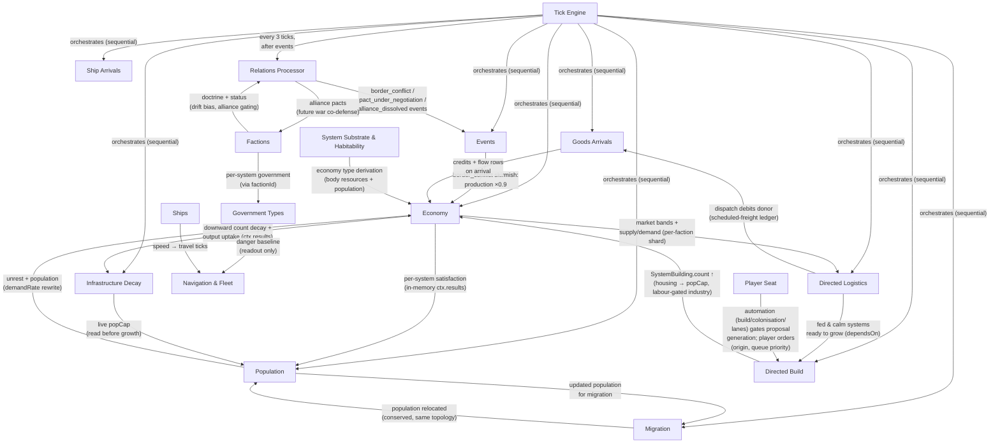

# Functional Specification

Master specification for the game. Describes what the game does, how systems connect, and links to detailed design docs. No code — for implementation details see `AGENTS.md`.

> **⚙ Re-conception in progress.** The game is a **single-player grand-strategy game** — a
> single-player, in-memory, no-login simulation of a living galaxy with the full map ([runtime
> spec](./active/engineering/single-player-runtime.md)). It is being re-conceived from a browser-based
> multiplayer space-trading game; the roadmap and design pillars are in
> [grand-strategy-vision.md](./planned/grand-strategy-vision.md). The Active Systems below describe the
> game as it works today; features still on the roadmap (the player seat, fog of war, war) are marked
> **planned**.

---

## Game Overview

Single-player grand-strategy game (working title pending — "Stellar Trader" no longer describes it). The player rules a spacefaring faction in a procedurally generated galaxy: starting from a small developed core, they colonise open space, develop worlds under real physical constraints (deposits, space, habitability, labour), steer a living simulated economy with population, unrest, migration, and logistics, and — eventually — convert economic strength into military power against AI factions running the same machinery. EU5-style control: everything is directly controllable and everything is automatable per domain. Design pillars and phasing in [grand-strategy-vision.md](./planned/grand-strategy-vision.md).

### Core Loop

```
Colonise → Develop → Supply → Specialise → Project power → Repeat
```

The player allocates each world's finite space between extraction, industry, and habitation (fractional magnitudes, not building slots), keeps their systems fed and calm through a logistics network whose effectiveness they invest in, specialises worlds into an interdependent economy, and grows population and industry toward the physical ceilings of their territory. Unrest, migration, and decay punish neglect. War (deferred, designed) makes the economy's stakes lethal.

---

## Active Systems

These systems are implemented and functional. Each has a detailed design doc.

### Universe & Map — [detailed spec](./active/gameplay/universe.md)
Universe size is chosen per game on the New-game screen — a system count (Zod-validated 50–20,000, default 600), a seed, and optional galaxy-shape knobs (cluster count/spacing/size-skew, void floor, corridor count/style, cluster turbulence, star spacing, cluster tightness, map size) that default to values derived continuously from the system count (the 600-system default is a ~7,000-unit map, ~10,000 systems a ~25,000-unit map). Map extent lives in generated world state (`meta.mapSize`, read from the atlas), not an env var. Systems are connected by jump lanes forming a navigable graph: a planar relative-neighbourhood graph links each cluster's own systems, and cross-cluster lanes exist only along the galaxy's planned corridors, realised as either a waypoint-chain band through raised density or a single higher-fuel crossing lane between two anchor systems. Each faction starts as a single developed homeworld in an otherwise-unclaimed galaxy and grows each cycle by claiming nearby unclaimed systems (`controlled`) and developing its controlled systems (`developed`) — ownership is a three-state system `control` flag, not a building; a system's owning faction (when it has one) sets its government type, and every system belongs to one region (which contributes a `dominantEconomy` label for orientation). The map uses a WebGL canvas (Pixi.js) with a two-tier rendering pipeline: a point cloud shows all systems as dots at universe zoom, while tile-based viewport loading fetches detailed system data only for visible tiles at close zoom. A LOD engine crossfades between tiers — zoomed out shows the point cloud, Voronoi-derived region boundaries, and region name labels; zooming in progressively reveals system names, economy badges, and connection fuel costs. A map-mode toggle selects what the territory layer paints: **political** (faction ownership, default), **regions**, one of five **value choropleths** — **stability** (the inverse of `unrest` — high unrest = low stability), **population**, **development**, **migration** (per-system attractiveness — the *pull*, reusing `migrationAttractiveness`), or **provision** (the per-system Provisioned percentage) — or **none**. The **magnitude** value modes are EU5-style: each cell prints its value as a number (coalescing system → faction-within-region → faction as you zoom out) over a relative gradient normalised to the visible scope, re-scaling to a focused faction's worlds when one is selected; **migration** and **provision** are colour-only (no natural printed unit for either — provision's own percentage lives on the per-system panel) and developed-gated (undeveloped/never-assessed = absent = black). Provision is also the one **stepped, absolute** exception: it samples a flat 4-band lookup at the Provision band edges instead of interpolating, and never re-scales to a focused faction, because its band edges are fixed percentages that would slide out from under the colours if re-normalised. A single additive **logistics** overlay (directed faction hauls drawn as particles on every lane of their route) sits on top of any mode; the lanes themselves are always drawn, weighted by invested level and coloured by load (see Logistics Lanes below). Every system is **selectable at any zoom** by clicking its Voronoi cell (not just the star hitbox), and every lane by clicking near its segment; a zoomed-out faction click opens the faction panel and re-scales the value gradient to it. Each system's dot is coloured by its **star type**. Gateway systems — a corridor's two anchor endpoints — serve as chokepoints for inter-cluster travel. Data loading at this scale is detailed in [map-data-loading](./active/engineering/map-data-loading.md) and the full rendering/selection model in [map-rendering](./active/engineering/map-rendering.md); there is no fog of war — every system is fully visible (per-player, ship-based visibility is planned).

### System Substrate & Habitability — [detailed spec](./active/gameplay/habitability.md)
Every system is built from a physical substrate — a sun (its class gates which body archetypes can roll), 1–N bodies (planets, asteroid belts, gas giants) each a climate-class archetype on a freezing→volcanic spectrum carrying two independent budgets: **habitable land** (only bodies whose habitability score clears `HABITABILITY_THRESHOLD` contribute it — roughly a third of systems are settleable, and blue-white/red-dwarf stars carry no above-threshold class at all, deliberately uncolonisable until terraforming or an adapted population type) and per-resource **authored deposit counts**, each carrying a poor/average/good/rich **quality band**. A colonised system works its best deposits first: built extractor levels are deemed to work the highest-value slots across a resource's hosting bodies, so yield is the worked-prefix mean of the ground those extractors actually sit on, not an average over every deposit whether built or not; population fills its best habitable-land body first, so quality — a direct multiplier on population growth — reads as a story about which bodies are occupied. A habitable-count damping ladder makes more than three habitable bodies in one system a fixed, non-tunable impossibility. Economy type (agricultural, extraction, refinery, industrial, tech, core) is derived bottom-up from the system's effective deposit potential (counts × quality yields) and population — no direct assignment, no region biasing; the galaxy is **extraction-dominant by design** (raw building blocks are needed in volume, and gas giants with no habitable land are truly dead). The faction-facing extensions (economy nudge on conquest, war targets) will be specced with the pivot's war phase (the old planned Facilities doc is deleted).

### Economy — [detailed spec](./active/gameplay/economy.md)
26 goods in 3 tiers (raw, processed, advanced) traded at station markets. Prices emerge from a single stock value per market via a pricing-anchor curve clamped to a **per-market band** — a demand-derived floor reserve and an infrastructure-derived ceiling (`Σ` building storage), replacing the legacy global `[5, 200]` — read as a single derived spot price; there is no personal buy/sell trading. Stock evolves through self-limiting production/consumption, band-relative noise, event modifiers, and government effects — equilibrium emerges from production/consumption balance plus directed logistics moving goods between systems, with no mean-reversion and no separate demand axis. **Only `developed` systems are economically active**: the economy tick, population, migration, and directed logistics all run on developed systems only (via the shared `isEconomicallyActive` predicate) — unclaimed and controlled systems are inert, their seeded markets frozen and population 0. Production is capacity-driven and **input-gated**: each system has a seeded industrial base (`SystemBuilding` counts — extractors bill authored deposit counts, population centres bill habitable land; factories, academies, specialisation complexes and construction centres bill no land at all, bound instead by labour, demand and decay), and per-good output equals `Σ count × outputPerUnit × effectiveFulfilment × inputGate × yield` where `effectiveFulfilment` is the head-count ratio `min(1, population / labour demand)` (population is the labour pool) further gated, for tier-1+ goods, by academy-licensed **skill ceilings** (see Economy Specialisation), `inputGate` throttles a tier-1+ good by the availability of its recipe inputs (1 for tier-0 extractables), and `yield` scales a tier-0 extractable by its deposit quality (1 for tier-1+). The 26 goods form a production chain: tier-1+ buildings draw their recipe inputs from local stock each tick, processed in recipe-topological order per system, so a shortage of any input **cascades** down the chain — cut an input's supply and every downstream good throttles in sequence. Consumption has two channels — universal civilian demand from a per-system **demand basis** (per-capita baseline + per-grade skilled-work consumption baskets — see Economy Specialisation S3) plus the production-input draw — and `demandRate` (the cycles-of-supply pricing denominator) sums both, so an input-heavy good (a refinery world's Ore) prices honestly rather than cheap-when-scarce. Economy type is derived, never assigned — it drives the system's display label and `Region.dominantEconomy`, but production and consumption never read it. **Population is dynamic** (Float, grows/declines/migrates): the economy processor records per-good satisfaction (`delivered / demanded`) each tick; the population processor folds these into **Provision** — the necessity-and-demand-weighted mean satisfaction, read as "the share of what this world needs, weighted by how badly it needs it" — judges it against a persisted per-world **expectation** of the Provision that population is accustomed to (rising fast in good times, resigning slowly in bad; seeded at a colony's own opening state, so newborns open calm), integrates into `unrest` (0…1) whichever reads larger of that **grievance** and an absolute famine/critical-good **crisis** term, applies logistic growth/decline (growth carries the absolute `1 − shortfall` factor, not the grievance), and rewrites `demandRate` for the new population and its labour allocation; a migration processor then relocates population along the same intra-faction topology. A four-band label (Supplied / Strained / Rationing / Deprived) is binned from Provision as pure description, with a fifth — Famine — punching through at any Provision value; no gameplay effect keys off the band; severity lives in two explicit overrides (a survival-good famine floor, which alone sets the Famine band, and a slope-only critical-good override). Chronic unmet demand raises `unrest`; high `unrest` triggers a strike state that smoothly suppresses production (consumption is never suppressed). A per-system **stability** readout (the inverse of `unrest`) surfaces on the map as a choropleth and as a per-system badge, and on the system screen as a Population tab (magnitude, `popCap` utilisation, unrest/stability, strike state, and a pressure-sorted per-good needs ledger — want vs delivered per good) and a stability row on the Overview. **Infrastructure is dynamic too**: `SystemBuilding.count` decays **downward** each economy shard toward what is actively *used* — gentle disuse where built exceeds staffed-and-selling (production/extraction) or occupancy (housing), plus a catastrophic unrest-driven teardown above a threshold — so `popCap` recomputes live from the surviving housing and a failing system sheds its industry; housing rotting below its occupants displaces the overshoot as migration ⊕ death. The **Industry panel** surfaces this per building as available (shared land headroom) · built · in-use, health-coloured (stable / idle / contracting / collapsing — idle names a whole level out only for want of a recipe input, a cause decay can't see and so will never shed on its own) …and surfaces the skill-tiered labour model — a system Labour card (workforce + the two academy-licensed skill ceilings), per-building health glyphs, academy-named idle reasons, and per-grade staffing tooltips.

### Open-Edge Topology & Flow Surfaces — [detailed spec](./active/gameplay/trade-simulation.md)
The galaxy moves goods and people along one shared substrate: the **faction-bounded open-edge topology**. An edge is open only when both endpoints share a faction (region lines ignored, sovereign borders closed). **Goods movement is entirely directed logistics** — a faction hauls its own surplus to its own deficits (see Directed Logistics); there is no passive price-gradient diffusion between markets. The same topology carries **population migration** (a parallel flow): population moves down-unrest / up-headroom along the same intra-faction graph, distance-attenuated by fuel cost, so people and goods share one map. Both are gated to developed systems. Each directed haul is recorded in a rolling flow-event log that feeds the **Logistics** map overlay and the per-system **Logistics tab** (imports/exports plus production/consumption and volume history) — routes are inferred from the event log, not stored.

### Directed Logistics & Autonomic Agency — [detailed spec](./active/gameplay/economy-autonomic-agency.md)
The *recovery* counterpart to SP3.5 infrastructure decay: factions deliberately act on their own territory to counter the decay ratchet and feed the suppliable middle of the galaxy. Two mechanisms share one slow agency clock (per-faction shard) and one "supply vs need" reading per system, built on two honest demand figures: the **use figure** (civilian want at full rate plus industry's staffing- and strike-gated draw when running) denominates every warehousing quantity — the deficit/surplus classification, donor floors, the self-supply gate — while the **draw figure** (the use figure further gated by each consuming factory's own output brake and live event modifiers) ranks import urgency. **Directed logistics** moves a faction's surplus to its own deficits — the sole goods-mover — severity-ranked (shortfall × draw, worst-first) multi-donor matching: each deficit draws from every reachable same-faction donor (own, unclaimed, or friendly-or-allied space, no distance limit) in route-cost order within a population-funded work budget (work = quantity × the route's lane-routed, congestion-priced fuel cost) — dispatch debits the donor and schedules the haul on the freight ledger, and the unconditional goods-arrivals stage credits the destination plus writes a `logistics`-tagged `TradeFlow` row on arrival — with whatever the matcher cannot serve — the work budget, reachable drawable stock, or genuine scarcity binding — left as a residual (the negative space). **Autonomic build** grows systems toward viable potential along a strict physical chain — habitable land → housing → population → industry: proactive housing leads (built ahead of population wherever `fed()` passes — survival satisfaction only, no unrest input — capped at habitable land), population fills it, and labour-gated industry follows the resident workforce (a build can only add what already-present population can staff). Industry placement is **demand-rate-driven**: the planner sizes built capacity to close a *rate* deficit (a good's local `production < demand`, with no reachable rate exporter to serve it) rather than to fill a cycles-of-supply stock target, so extraction grows tier-by-tier as each factory's input draw appears — the stock buffer is a passive shock-absorber, never a build goal. Unmet tier-1+ shortfall additionally **spills down the recipe chain as derived demand**: where a factory cannot be proposed because a recipe input is missing, the planner adds the input's share of the shortfall onto that input — netted against the pooled rate spare of reachable producers (mirroring how structural gaps share exporter spare), cascading reverse-topologically down to tier-0 extraction, recomputed each planner run and never persisted — so colonies stand up the supply chains for goods they cannot yet make, bottom-up. Queued input levels count as available (deliberate pipelining — the chain builds ahead of itself and the economy's input gate throttles the factory until its input lands). **Survival-serving builds (water, food) rank above all others** at both the opportunity claim order and the funding order (housing still leads funding; score/ROI order within each band) — the same necessity band the alert bar applies on read, now applied where builds are chosen. The planner is a clean decision → gate → pacing pipeline (rank rate-deficit opportunities → fit to spare labour/space/whole-levels → the construction pool alone paces the committed queue). The pool is **eligible heads** — population minus heads actually employed in skilled jobs, so an industrialising faction's raw labour throughput erodes as skilled employment grows — substitutable with capital via **Construction Centres**, a non-producing building whose staffed output is priced off the backlog frontier (a construction point is worth the best work the pool can't yet fund) and which competes on the same ROI ordering as any other proposal. Build and decay share one equilibrium (occupied housing, staffed-and-selling industry), so a viable system sits at potential with both ≈ 0. Capacity-bounded; the work both mechanisms perform is billed each cycle to the owning faction's treasury, whose latched funded fraction scales what share of each pool's physical throughput runs the following cycle (money is fuel, not capacity — funding can starve a pool but never raise it past the physical ceiling). No claimable contracts (the player-facing trade layer is a later rework). Logistics-first sequencing is deliberate: supply makes a system viable, and a viable system builds.

### Logistics Lanes — [detailed spec](./active/gameplay/logistics-lanes.md)
Every jump lane is a persistent object (`WorldLane`) carrying an invested **level** (float, ≥ 0;
level 0 is a small baseline transit allowance, no impassable lane except a future severed one) and
a **capacity** that rises linearly with it, scaled by catch-up so congestion readings are
interval-invariant. A faction may invest in a lane exactly when it controls both endpoints
(`control ≥ controlled`); an unclaimed endpoint pins the lane at baseline, which is what makes
corridor systems worth claiming — the player claims one adjacent unclaimed system at a time, free,
on a cooldown, while AI claiming is adjacency-bounded and floor-softened to absorb dead systems as
factions grow. Every directed-logistics haul routes over a real cheapest path across open lanes,
priced by each edge's `fuelCost` times a congestion multiplier bounded above by a stated constant;
a lane whose booked load reaches capacity is excluded from the route graph for the rest of the run,
so a haul reroutes or turns away rather than pricing through unboundedly, and the turned-away
volume is its own signal (never folded into `unservedShortfall`). Transit is **scheduled, not
positionally simulated**: dispatch computes an arrival tick from the whole route's summed fuel cost
over one freight-speed constant, debits the donor immediately, and the unconditional per-tick
goods-arrivals stage credits the destination (band-capped, any remainder returned to the donor as a
reversed-route leg) when the haul's transit time is up — one shared routing substrate, traversal
policy supplied per client (goods route over own+unclaimed+friendly-or-allied; migration keeps its
own narrower rule), with a read-only interdiction query reserved for war's future severed-lane verb
and called by nothing yet. Lane upgrades are `kind: "lane_upgrade"` projects in the shared
construction queue, funded and prioritised exactly like a build; upkeep is its own term summed into
`bills.maintenance`; a lane decays one level after a sustained idle buffer of unused capacity,
reset by any run that uses it. The autonomic planner proposes upgrades on congestion-binding lanes
on the same ROI ordering as every other opportunity, gated by its own player automation switch. See
[universe.md](./active/gameplay/universe.md) for how the lane graph and its fuel costs are
generated.

### Construction & Colonisation — [detailed spec](./active/gameplay/colonisation.md)
Territorial growth is two ownership steps a cycle: a cheap, near-instant **claim** (`unclaimed → controlled`) stakes a border, and a priced, pool-funded, timed **develop** (`controlled → developed`) settles a controlled system into a live colony. Claims stay free (a claim is a territorial intention); **founding is priced**, in three streams at once — a one-off **charter fee** (`max(CHARTER_FEE_MIN, CHARTER_FEE_SPEND_MULT × the reference-descaled maintenance bill)`, paid in queue order at commitment and by design the dominant monetary cost), the **founding manifest staged per cycle** (a work-matched share of `FOUNDING_STOCK_COVER` cycles of the seed's own basket, drawn from the founder's spareable stock under the same `surplusDrawable` export rule and **paid for** at catalog reference prices through one S-normalised valuation seam), and the *colony-establish* **work** itself, drawn from the same per-faction construction pool that builds housing and industry and billed generically through the construction band. So expansion competes with build-out on **one ROI axis** — a colony's value is the unmet demand its deposits unblock plus the forward option value of its land (gated by territory saturation) minus the opportunity cost of the population it seeds, ranked directly against build ROIs and funded front-first from the pool (no per-cycle develop cap; a settler-supply gate throttles founding to what the faction can populate) — while money is a **gate, never a value term**: a candidate is proposed only while a real per-faction running working balance (`balance − pendingFounding`) still covers `charter + FOUNDING_GATE_HEADROOM × its projected material bill`, so a poor faction stops expanding on its own and pacing emerges from cost rather than an authored rate. Materials gate work: a cycle's absorption is capped by the share of that cycle's manifest slice the treasury can buy (a good the founder cannot spare counts as satisfied, so a thin founder thins the endowment instead of deadlocking the project), and a founding that stages nothing for `FOUNDING_STALL_COMPLETE_CYCLES` writes off its remainder and finishes on work alone. Every completed establish lands a colony **viable by construction** — a tiny conserved seed population, the housing to hold it, and its staged manifest credited onto its own new market rows — so `popCap` never welds to a stranded seed and a colony no longer opens holding nothing. Colonies then bootstrap from a two-person spark: **routed colonist delivery** water-fills spare population from the cores out to the emptiest frontier, **fullness-gated migration** lets an empty colony draw settlers ahead of its jobs (whose consumption pulls the industry that staffs them), and proactive housing leads population so the cap grows as it fills. The galaxy starts from these cores — each faction capital is stamped with an identical self-sufficient **home-system prefab**, every other system an empty deposit field expansion colonises into. Colonies can also **end**: people do not move to famine worlds (a system in survival shortfall receives no population inflow that cycle — colonist delivery skips it as a sink and diffusion migration moves nothing toward it; outflow unaffected, the gate stateless and re-opened by recovery), and a famine world whose population collapses below **`ABANDON_POP_FLOOR` (1 pop)** is **abandoned** — reset in one tick-body application to unclaimed, factionless frontier (population/unrest/collapse-debt zeroed, expectation memory deleted, buildings deleted and `popCap → 0` since decay never runs on non-developed systems, market rows kept with their stock but demand-derived fields reset, open `build` projects targeting it dropped) and ordinarily claimable again. For the player's faction, both halves are also directly directable — see Player Seat below.

The committed-construction queue (`world.constructionProjects` — industry `build` levels, `colony_establish` projects, and `lane_upgrade` projects, each carrying an `origin: "auto" | "player"`) surfaces tick-live on two screens. The system **Overview** carries a **Construction** vital tile (open-project count, linking to Industry) on any developed system, and — on a controlled, not-yet-developed player system — the colonisation founding entry (establish verb + preview, the forming project, or the disabled verb with its blocking reason). The system **Industry** tab renders every in-flight build as a **ghost row inside the ledger group it will join** (extractors under their deposit, everything else under its Housing/Academies/Specialisation/Production/Support heading), with an exact progress bar, funding rate, and a coarse ETA (`fundQueue` forward-simulated at the current pool — the bar/percent is exact, the ETA an estimate). The faction **construction command card** rolls the whole faction's queue into pool composition (base + Construction Centre share) and three link lists — systems building, colonies forming, lanes — each linking to its system's Industry tab or lane card; the player's own card additionally carries the automation switch trio. One pure readout (`computeFactionConstruction`) feeds every surface. All are tick-invalidated on the economy cycle start.

### Player Seat — Control & Construction Verbs — [detailed spec](./active/gameplay/player-seat.md)
The player's faction runs the same autonomic brain as every AI faction, with a control surface layered on top. **Per-domain automation switches** (`world.player.automation.build` / `.colonisation` / `.lanes`, all default on) gate the directed-build planner's *proposal generation* for the player's faction only — turning one off stops new autonomic proposals in that domain while already-committed funding and manual orders continue unaffected; AI factions never read the field. **Manual verbs** — order a build (quick-add `+` on any Industry-tab ledger row, or a new-industry dialog for a type with no row yet), direct a colony (an Establish verb + preview on a controlled system's Overview, same eligibility and sizing the planner itself uses), invest in a lane (raises its invested level, funded from the same construction pool), claim an adjacent system (free, rate-limited to one per cooldown), and cancel (player rows only; spent work is lost) — write into the same `world.constructionProjects` queue as autonomic proposals, tagged `origin: "player"`. **Queue priority** (`orderOpenProjects`) is a stable partition — committed work first, then fresh player orders, then new autonomic proposals — that is an identity on any queue with no player rows, so the playerless calibration harness is unaffected. **Feasibility** (`computeBuildOptions`) is one shared computation: space/deposit-slot ceilings are hard rejections everywhere the planner itself respects; a labour/staffing shortfall is a warning, never a block — the player may overbuild what their population can staff, and staffing dilution + idle-decay punish that choice honestly.

### The Purse — Faction Treasury — [detailed spec](./active/gameplay/player-seat-purse.md)
Every faction — player and AI identically — runs a treasury that fills from two taxes on real economic activity (**grade-weighted employed heads** and **realised production at fixed reference values**, scaled by a five-step **tax level** whose cost is unrest) and drains through three **budget bands** — maintenance, logistics, construction — each a 0–100% funding slider against that band's bill. Money is *fuel, not capacity*: a band's latched funded fraction scales what share of its pool's physical throughput runs; wealth never buys past the physical ceiling. Settlement is per cycle, collect-then-pay in a fixed ladder (maintenance → logistics → construction), no debt; the paid fraction *is* the effective funding level, so insolvency — never a slider — is the only path below the maintenance floor into destructive decay. One expense sits **outside** the bands: **founding** (colony charter fees + staged materials) accrues into `pendingFounding` and is taken off the balance *before* the ladder divides anything, so committing to colonies genuinely competes with paying the bills; it settles as its own `foundingExpense` line on the ledger and in `net`. Player surfaces live on the faction panel: a ledger-stack treasury card (itemised income/expenses, set-vs-runs band bars, tax stepper — interactive only for the player's faction, identical read-only on AI factions), a Treasury vital tile, and a funded readout on the construction card. Money is ECONOMY_SCALE-invariant by construction.

### Economy Specialisation — Skill-Tiered Labour — [detailed spec](./active/gameplay/economy-specialisation.md)
Manufacturing's specialisation gate (stage **S1** of a four-stage track). A good's staffing is a per-good 3-grade vector `(unskilled, skill1, skill2)` that **partitions** its head count; two **academy** buildings — a vocational school (skill-1) and a research institute (skill-2) — raise a *ceiling* on how much of the existing population may work each skilled grade (population stays a single scalar — skill is not a kind of person). Per-good output is gated by `effectiveFulfilment(tier)` = the head-count ratio min'd with the skill-fulfilment ratios (`skillCap / skillDemand`) the good's tier draws on, so a frontier world with **no academy physically cannot run tier-1+ manufacturing**, and a tech hub must sink space + population into academies (and so can't also be broad → it imports the rest). Academies bill no land, draw unskilled labour, decay toward the skill demand they actually serve, and are **co-built by the autonomic planner** as a buildable labour gate when a skill ceiling blocks a deficit-serving build. Per-good `spaceCost` is vestigial for tier-1+ production — it once differentiated factory footprints against a shared land budget that was deleted, and today is only a positive/zero existence check. Stages S2 (specialisation complexes) and S3 (demand concentration) are shipped — see the next sections; stage S4 (guardrails) remains planned — see the [track vision](./planned/economy-specialisation.md).

### Economy Specialisation — Specialisation Complexes — [detailed spec](./active/gameplay/economy-specialisation-s2-complexes.md)
Manufacturing's comparative advantage (stage **S2** of the track). Five production **families** partition the 18 tier-1+ goods (heavy industry, chemicals, electronics, armaments, consumer goods); each family has one **specialisation complex** — a non-producing anchor building (no land cost, small unskilled staffing, **capped at one complex per system across all families** — "one industrial identity") whose presence multiplies the *yield* of every family good produced there, linearly up to one full complex. The buff folds into `buildingProduction`, so production, input demand, and the read services inherit it with no separate read path. Complexes decay toward the family throughput they actually buff (rated coverage), are seeded at each system's dominant family where projected throughput clears a floor, and are **co-built by the autonomic planner** exactly as academies are — charged to the same deficit-serving opportunity. Family goods score at their buffed per-unit, so an anchored site out-ranks a greenfield rival and production concentrates structurally (the snowball) — arresting the price-flattening a matured galaxy otherwise settles into. Nothing is restricted: the one-per-system cap, not land, is what keeps a site from anchoring two families. The Industry panel renders complexes as their own Specialisation group; tooltips list the family's goods and the current yield multiplier. Magnitudes are coarse first-cut, tuned in the single S1–S4 calibration pass.

### Economy Specialisation — Development-Tiered Demand — [detailed spec](./active/gameplay/economy-specialisation-s3-demand.md)
Demand's specialisation gradient (stage **S3** of the track). Civilian consumption derives from a per-system **demand basis** `{population, technicians, engineers}` instead of bare population: skilled work *actually performed* (from `computeLabourAllocation` — bounded by jobs, academy licence, and headcount, so a hub that loses its industry sheds the discretionary demand with it) adds per-grade **consumption baskets** on top of the flat per-capita baseline — the technician basket consumer_goods-dominant, the engineer basket luxuries-dominant with luxuries engineer-exclusive. Basics are never reduced; development only *adds* demand, so developed hubs become the galaxy's big discretionary importers exactly where S1/S2 space+labour scarcity stops broad self-supply — demand concentrates where supply can't (the signal derives from buildings + population only; no feedback circularity with satisfaction or unrest). Threaded through the single `consumptionRate` chokepoint so pricing, satisfaction weights, seed, and the tick adapters all inherit it; the Labour card's skill chips list each grade's basket, and Population-panel demand rows carry a base/technicians/engineers composition tooltip. Magnitudes are coarse first-cut, tuned in the single S1–S4 calibration pass.

### Events — [detailed spec](./active/gameplay/events.md)
Three event types, all spawned exclusively by the relations processor from faction-pair scores — never by random dice (border_conflict, pact_under_negotiation, alliance_dissolved — see Inter-Faction Relations below). `border_conflict` runs a three-phase arc (Border Tension → Skirmish → De-escalation), applying a production ×0.9 modifier at its target system only during Skirmish; the other two are single-phase, untargeted political-map signals resolved by the relations processor's own metadata rather than by phase expiry. The general phase/modifier machinery survives underneath for future mechanic-owned arcs, but nothing spawns randomly and no event spreads to neighbouring systems.

### Market Inspection
The market screen is a read-only inspection surface: per-system current prices, stock levels, and a cross-system price comparison (heatmap overlay + comparison panel). Prices update dynamically based on each good's stock via the economy tick. There is no personal buy/sell trading — goods move through directed logistics, not player hauling.

### Navigation & Fleet (backend only) — [detailed spec](./active/gameplay/navigation.md)
Ship travel exists as **backend mechanics with no player surface** — there is no fleet, navigation, or refuel UI, and world-gen seeds no ships. The travel model is intact: travel time scales with the ship's `speed` stat, fuel is deducted at departure, and the ship-arrivals processor docks ships on arrival (dormant while no ships exist). There is no danger pipeline, convoys, cargo, or repair. System danger remains a world attribute displayed on the system overview (government baseline + feature danger + body danger), consumed by nothing mechanically (events/war will reuse it). Player fleets and route planning are planned.

### Ships — [detailed spec](./active/gameplay/ship-roster.md)
12 ship classes across 3 sizes (small, medium, large) and 5 roles (trade, combat, scout, stealth, support). Size sets the baseline profile — small ships are nimble and stealthy; large ships absorb damage but can't hide or dodge. Combat-facing stats (hull, shield, firepower, evasion, stealth) are inert until the war layer; `speed` and fuel drive travel. The roster is data only — there is no player fleet; ships become faction assets when the player seat and war layers are built.

### Factions — [detailed spec](./active/gameplay/faction-system.md)
The political layer. 8 major factions plus minor factions (12 at default scale, 18 at 10K). Each faction starts as a **single developed homeworld** in an otherwise-unclaimed galaxy — homeworlds are spaced apart and seed-biased for good substrate, and every other system begins unclaimed (`factionId: null`), unpopulated. Ownership is a three-state system `control` flag (`unclaimed | controlled | developed`), not a building: each cycle a faction claims one in-reach unclaimed system (controlled) and develops one of its controlled systems (developed). Each faction has a government type (one of 8: federation, corporate, authoritarian, frontier, cooperative, technocratic, militarist, theocratic) that drives its economic identity, and a doctrine (one of 5: expansionist, protectionist, mercantile, hegemonic, opportunistic) that drives political behaviour. Government type is sourced per-system from the owning faction (unowned systems read as frontier). Faction status (dominant / major / regional / minor) is derived from share of factioned systems with hysteresis at the boundaries — scale-independent — so **major/minor status emerges from expansion** rather than being seeded. Faction overview UI lists factions with a detail page showing territory sample, doctrine, government, relations, alliances, and recent border conflicts. On New Game the player authors their own faction (name, government, doctrine), seeded as an additional major alongside the 8 presets and marked as the controlled faction by `world.player` (shown with a **You** tag). The player's faction runs the same autonomic agency as any AI faction, with a control surface (automation switches, manual construction/colonisation verbs) layered on top — see Player Seat above.

### Inter-Faction Relations — [detailed spec](./active/gameplay/faction-system.md#2-inter-faction-relations)
Per-pair score (-100 to +100) drifts every 3 ticks via a dedicated relations processor. Drift drivers: a constant negative baseline ("peace needs maintenance"), border friction (cross-faction jump lanes), doctrine compatibility, sparse government opposition, common-enemy bonus, recent trade volume, active-alliance maintenance, and alliance-with-enemy penalty. Five tiers (allied +75 / friendly +25 / neutral / unfriendly -25 / hostile -75). The processor spawns `border_conflict` events (one active per pair, three phases applying production modifiers) when a pair drops to ≤-25, telegraphs alliance formation via `pact_under_negotiation` events (5–10 tick negotiation window, must hold ≥+60 to confirm), and dissolves alliances below +50 via `alliance_dissolved` events. Pact records and per-pair history (last 10 drift entries) are stored.

### System & Faction Detail — [detailed spec](./active/design-system/detail-panels.md)
The player-facing read surfaces are **left-docked, non-blocking drawers** the live map stays interactive behind — clicking another system re-points the open drawer in place, no open/close churn. Both the system and faction screens are **tabbed** over one shared, reusable **vitals grid** (`VitalTile` — loud label/value/meter tiles that share the map's mode hues). The system panel runs **Overview · Astrography · Population · Industry · Logistics · Market** (loud stability/development/population vitals over a quiet context strip, the industry deposit/space tables + skill-tiered Labour card, decay-grounded stable/contracting/collapsing health, and the pressure-sorted needs ledger — per-good satisfaction with met needs collapsed, the base/technician/engineer tier split in each row's tooltip). The faction panel runs **Overview · Diplomacy · Territory** — a Victoria-3-style country panel: aggregate vitals + identity, the relation-score stance, and the full territory list. Faction- and region-level roll-ups (the Overview vitals **and** the map's zoomed-out numbers) are **quantity-aware** — extensive magnitudes (population, development points) sum, intensive stability is a population-weighted mean — so a faction spreading into new systems never reads as decline when it is only spreading thin. Mostly a read-only reporting surface; the player's own territory additionally carries the construction/colonisation control verbs and the faction's automation switches (see Player Seat above).

### System View — [detailed spec](./active/gameplay/system-view.md)
The Astrography tab draws a system as a **place**: the star centred, each body on its own concentric ring, sitting above the body cards rather than replacing them. Hovering a body surfaces exactly what its card already shows (archetype, habitability band, lock, occupancy, habitable land, per-deposit worked/total) — a second presentation of `SystemSubstrate`, computing nothing new. A body's ring is **cosmetic and inert**: `orbitIndex` is rolled once at generation, stored, and read by nothing in the tick, so two systems with identical bodies in different ring orders behave identically. Which ring comes from a **weighted draw, not a sort** — each archetype carries an authored orbital bias (volcanic and arid low, temperate and ocean mid, tundra and frozen high, gas giants highest, belts between rock and giants) and each body takes a key of `bias + noise`, with the spread authored wide enough that exceptions genuinely occur. That looseness is the design point, not a tolerance: atmosphere rather than distance decides how warm a world is, so a hard gradient would erase the cases that make a system look like it has a history. Placement **around** a ring is derived and never stored (`i × 137.5°`), so the arrangement is identical across renders, saves and sessions with no angle to persist. Bodies draw as plain coloured circles sized from the display-flavour-only `size`, an occupied body carries the body card's own green, a locked one is dashed, and an asteroid belt draws as its own dashed ring — the one body that was never a point. Rings grow inward, so the diagram stays square inside the fixed 560px panel whatever the body count. The standing constraint: **nothing may read `orbitIndex` except the view that draws it** — a mechanic wanting real orbital distance introduces its own quantity and says what it means.

### The Tracker — [detailed spec](./active/gameplay/tracker.md)
The first of the attention layer's two surfaces, and the one that holds **things** — never conditions. A right-edge rail panel, sharing one flex container with the map controls dock (the dock takes its natural height, the Tracker takes the rest and scrolls internally, so overlap is impossible by layout rather than by a kept-in-sync estimate). Three lists: **Pinned systems** (player-curated, insertion-ordered, each a single line carrying population and stability as icon-plus-number), **Building** (the construction work the pool is actually funding this cycle — the funded front, capped at ten rows in queue order, with two deliberately unmerged counts beneath it: rows hidden by the cap are still being funded, rows behind the front are not), and **Colonising** (one row per forming colony — the only surface that says where a colony is coming into being, since the map shows nothing until it exists). Build and colony rows carry a 2px progress bar flush to the row's bottom edge. Clicking any row flies the map to that system and opens the tab where the thing lives (Overview for pinned and colony rows, Industry for builds), reusing the "Show on Map" focus mechanism including its counter. Hovering opens a **popover**, and a card describes its row's subject: a pinned row's card carries the system's vitals plus an unpin control, a project row's card carries the project. Pinning is a **star toggle** in the system panel header (a star, not the map-pin glyph that header already uses for *locate*) — the route from the system panel, with the card's unpin control the route from the Tracker; both work by mouse and by keyboard. A **settings panel opens to the left of the Tracker** inside the same rail, one toggle per section, stored in the save on the player seat. Pinned system ids and section visibility are the new world state (`world.player.pinnedSystemIds`, `world.player.trackerSections`, saved and restored); **nothing in the tick reads them**, and stale pins are filtered on read so abandonment needs no tick write. The popover primitive (`Popover`) is built on Radix's Popover, whose content is keyboard-reachable; it is the second, richer tooltip tier beside the existing plain tooltip. A `dwell`-mode popover opens at the cursor and fills a hairline bar before it locks and can be entered, and any term inside its body can itself be a `TermLabel` opening a further popover, nested to whatever depth the player follows — an n-deep ancestor stack replaces the old single-open pointer, with older levels fading by depth and the whole chain dismissing once the pointer leaves it. A locked chain can be pinned to survive while another is opened beside it, and the same Pin control unpins it again. The industry panel, system astrography, the population panel, the potential-yield table, and the provision and logistics row bodies use dwell popovers today, and term triggers also sit on the system overview, needs and stability popovers, the treasury, diplomacy, alert and tracker headings, and the top bar's `UST` clock stamp. The concept glossary that backs every trigger is data (`lib/glossary/terms.ts`), kept verbatim with `docs/active/glossary.md` by test; player-facing copy follows that glossary's vocabulary — one term, one word, everywhere. Every popover obeys one keyboard convention: opening never moves focus, **ArrowDown** on the trigger enters the popover (Enter on a `TermLabel`/`dwell` trigger opens it directly, already locked), **Escape** leaves it and returns focus to the trigger, and Tab cycles within an entered popover.

### The Alert Bar — [detailed spec](./active/gameplay/alert-bar.md)
The second of the attention layer's two surfaces, and the one that holds **conditions** — never things. A run of small icon-plus-count chips floating over the top of the map, inset to the span between the system drawer and the Tracker rail, ordered by three authored tiers (critical / important / informational) and never by a computed cross-domain score — categories sort by tier, instances sort only within a category, by that category's own natural measure. Fourteen categories: ten developed-system warnings (Dying worlds, Strike, Deprived worlds, Unrest rising, Overcrowded, No housing headroom, Survival stock falling, Demand unservable, Build blocked, Industry idle), one lane-scoped warning (Lane congested — a lane the player can act on turned hauls away at capacity this run, counted against the player's actionable lanes, each row opening the lane card), one faction-level warning (Maintenance unfunded), and two automation-gated opportunities (Build opportunity, Colony opportunity, each visible only while its domain's automation is off). Lane congested is scoped to lanes, not systems: any lane the player faction can act on (its investor, or either endpoint held) that turned volume away at capacity this run, one instance per lane, sorted by blocked volume descending; clicking a row opens the lane card and recentres the map on the lane's midpoint. Events carry no alert-bar category — the three relations-owned event types surface only in the faction-diplomacy panel and the faction-events list. Dying worlds' condition is a smoothed, founding-excluded population decline rate — famine or not — so a well-fed world falling to unrest alone raises it too, not only a famine-gated one. A chip appears the moment its count leaves zero and clears the moment it returns, with no grace window; clicking one opens a flyout listing every instance in the category's own sort order, and clicking a row flies the map to it without closing the flyout. The critical tier cannot be hidden — the settings panel offers no control and the write boundary refuses one; three important-tier categories (Unrest rising, Build blocked, Industry idle) default off. Category visibility is stored in the save on the player seat (`world.player.alertCategories`), like every attention-layer setting: per-save, whatever kind of setting it is. The flyout and the per-category settings panel are both `Popover` consumers, sharing that primitive's collision detection, dismissal and one-open-at-a-time behaviour with the Tracker's own cards. Processors persist six signals purely for this surface (a realised per-cycle population/stock change, a smoothed founding-excluded population trend, the planner's blocked-opportunity reason, its best-ranked scored build terms, the pre-gate colony assessment's terms, and directed logistics' structural unserved-shortfall level) — all additive, optional and read by nothing inside the tick — plus the lane engine's own per-lane blocked volume (`WorldLane.blockedVolume`), which predates this surface and, unlike the six, is also read back inside the tick by lane decay.

### Tick Engine — [detailed spec](./active/engineering/tick-engine.md)
Game clock advancing under a player speed dial (pause / 1 / 5 / max ticks per second — max runs a yielding loop to a CPU-bound ceiling). 10 processors run sequentially in topological order via the one shared tick body (`runWorldTick`): ship arrivals, goods arrivals, events, economy, infrastructure decay (depends on economy), population (depends on economy + infrastructure decay), migration (depends on population), directed logistics (depends on economy), directed build (depends on directed logistics), relations (every 3 ticks, depends on events). Each declares its dependencies and an optional frequency. Economy, infrastructure decay, population, and migration resolve the whole galaxy together on a **cycle start** (every `CYCLE_LENGTH` ticks, regardless of universe size); the economy records per-system satisfaction into an in-memory context field the decay and population processors read the same tick. Directed logistics and directed build each resolve the whole galaxy on their own cycle (`LOGISTICS_INTERVAL`, `CONSTRUCTION_INTERVAL`), independently tunable from the cycle; relations processes all faction pairs every 3 ticks. Each cycle interval is a real knob, not merely a performance one — every rider scales its per-run flows and per-cycle budgets by `catchUpFactor(interval)`, so tuning an interval changes granularity, not wall-clock rate (guarded by an interval-invariance sim test plus a full-scale harness pair); `REFERENCE_INTERVAL` (24) is the calibration anchor and stays fixed. All processors run against the in-memory world; a failing tick hard-pauses the loop and the tick counter does not advance (the store only accepts a fully-successful tick — no transaction). Results are broadcast to the UI over the worker→UI channel as pacing and state frames (throttled to ~4 Hz).

### The Calendar
One tick is six in-world hours (`HOURS_PER_TICK`, `lib/constants/tick-cadence.ts`) — four ticks per in-world day. The 24-tick economic cycle is therefore a fictionally-named six-day week; its in-world length is always **derived** as `CYCLE_LENGTH × HOURS_PER_TICK`, never an independent day count, so retuning the cycle changes the week's length without ever touching what a tick means. A year is ≈60.9 cycles, ≈1,461 ticks. External anchor: Victoria 3 runs four ticks per day. Every rate default is set against this anchor from a real-world reference point in real units — population grows at a frontier-boom ceiling (≈3%/year, the pace of 19th-century mass-immigration frontiers), buildings take months to years to complete, and founding a colony takes about 2.8 years — never the other way around: a rate can fail the calendar's definition, but no rate is ever tuned first and the calendar derived from it. The player reads a fictional calendar derived from the tick alone (`lib/constants/calendar.ts`, `lib/utils/calendar.ts`): day = 4 ticks, month = 30 days, year = 12 months = 1,440 ticks — a clean 360-day fictional year, deliberately distinct from the ~1,461-tick real-unit year the rate anchors use — starting at epoch year 2350, so tick 0 renders `2350.01.01`. The top bar shows the date (with time-of-day stepping 00:00/06:00/12:00/18:00; the raw tick survives only in its tooltip), absolute stamps (diplomacy history, save list) render as dates, and every player-facing duration goes through one auto-scaling rule (hours → days → months → years). Per-cycle rates keep the cycle as their unit — the 24-tick economic cycle remains fictionally a six-day week and its in-world length stays derived, never a second literal. Display-only: nothing in the tick or save reads the calendar.

At fast mode's 5 ticks/s, a 100-year arc is ≈146,000 ticks ≈ 8 wall-clock hours of continuous play — in the same league as Victoria 3's own ≈146K-tick century at 4 ticks/day, which is the genre reference this anchor targets.

### Single-Player Runtime — [runtime & worker spec](./active/engineering/client-runtime.md) ([world storage & save format](./active/engineering/single-player-runtime.md))
No login and no database. The whole world lives in memory inside a Web Worker running in the browser tab (a Node process for `npm run simulate`); the tick advances inside the worker under the speed dial, and the UI thread never runs a tick — it reads a synchronised snapshot store fed by frames over the worker channel. The entry surface is a start screen — **Continue** (rolling autosave) · **Load** (named saves) · **New game** (author a faction, then system count + optional seed) — and saves are JSON snapshots of the whole world: written to IndexedDB in the browser (one rolling autosave every 60 s + on pause + on tab close/refresh, plus manual named saves and export/import), or to local disk in the desktop packaging; saves break on world-shape change, pre-1.0. There is no auth or credits, and no per-player *session* state beyond `world.player` (the controlled faction, its per-domain automation switches, its Tracker-pinned system ids, and its attention-layer settings); the player authors a faction on New Game and the map auto-focuses its homeworld. Direct player-control verbs (construction/colonisation orders, automation toggles) are implemented — see Player Seat above. The faction purse is fully live — treasuries, effects, and the player surfaces (see The Purse above; spec in `docs/active/gameplay/player-seat-purse.md`). Both of the attention layer's surfaces — the **Tracker** and the **alert bar** — ship (see below). The runtime is held to purity/determinism rules (seeded RNG, no wall-clock in tick math, serialisable world state) so a lockstep-multiplayer packaging stays a transport swap.

---

## System Interaction Map

How the active systems connect and affect each other:


```mermaid
flowchart TD
    TE[Tick Engine]
    SA[Ship Arrivals]
    GA[Goods Arrivals]
    EV[Events]
    EC[Economy]
    POP[Population]
    ID[Infrastructure Decay]
    MIG[Migration]
    DL[Directed Logistics]
    DB[Directed Build]
    REL[Relations Processor]
    NF[Navigation & Fleet]
    SH[Ships]
    FA[Factions]
    GOV[Government Types]
    TR["System Substrate & Habitability"]
    PS[Player Seat]

    TE -- "orchestrates (sequential)" --> SA
    TE -- "orchestrates (sequential)" --> GA
    TE -- "orchestrates (sequential)" --> EV
    TE -- "orchestrates (sequential)" --> EC
    TE -- "orchestrates (sequential)" --> ID
    TE -- "orchestrates (sequential)" --> POP
    TE -- "orchestrates (sequential)" --> MIG
    TE -- "orchestrates (sequential)" --> DL
    TE -- "orchestrates (sequential)" --> DB
    TE -- "every 3 ticks,<br/>after events" --> REL

    EV -- "border_conflict skirmish:<br/>production ×0.9" --> EC

    EC -- "per-system satisfaction<br/>(in-memory ctx.results)" --> POP
    EC -- "downward count decay +<br/>output uptake (ctx.results)" --> ID
    ID -- "live popCap<br/>(read before growth)" --> POP
    EC -- "market bands +<br/>supply/demand (per-faction shard)" --> DL
    DL -- "dispatch debits donor<br/>(scheduled-freight ledger)" --> GA
    GA -- "credits + flow rows<br/>on arrival" --> EC
    DL -- "fed & calm systems<br/>ready to grow (dependsOn)" --> DB
    DB -- "SystemBuilding.count ↑<br/>(housing → popCap, labour-gated industry)" --> EC

    PS -- "automation (build/colonisation/<br/>lanes) gates proposal<br/>generation; player orders<br/>(origin, queue priority)" --> DB

    POP -- "unrest + population<br/>(demandRate rewrite)" --> EC
    POP -- "updated population<br/>for migration" --> MIG

    MIG -- "population relocated<br/>(conserved, same topology)" --> POP

    FA -- "per-system government<br/>(via factionId)" --> GOV
    FA -- "doctrine + status<br/>(drift bias, alliance gating)" --> REL

    GOV -- "danger baseline<br/>(readout only)" --> NF

    REL -- "border_conflict /<br/>pact_under_negotiation /<br/>alliance_dissolved events" --> EV
    REL -- "alliance pacts<br/>(future war co-defense)" --> FA

    TR -- "economy type derivation<br/>(body resources + population)" --> EC

    SH -- "speed → travel ticks" --> NF
```

Key interactions:
- **Events → Economy**: The only live effect is `border_conflict`'s Skirmish phase, which multiplies production ×0.9 at its target system. Nothing else in the economy tick reads event state
- **Economy → Population**: The economy processor writes per-system satisfaction (`delivered / demanded`) into an in-memory context field (`ctx.results`); the population processor reads it in the same tick to integrate `unrest` and apply growth/decline. This handoff is transient — not persisted, not broadcast.
- **Economy → Infrastructure Decay → Population**: After the economy commits market/labour state, the infrastructure-decay processor runs on the same shard (reading the economy's `ctx.results` — its processed system set + per-good output uptake). It shrinks `SystemBuilding.count` **downward only** toward what is *used* (disuse where built exceeds staffed-and-selling/occupancy, plus an unrest-driven teardown above θ), and recomputes `popCap` live from the surviving housing. Population then runs *after* it (`dependsOn` economy + infrastructure-decay), reading the fresh `popCap` before growth/decline — so housing that rots below its occupants displaces the overshoot (unrest-weighted migration ⊕ death).
- **Economy → Directed Logistics → Goods Arrivals → Economy**: On its logistics cycle (`LOGISTICS_INTERVAL`), directed logistics reads each developed system's market bands + supply/demand, greedily matches a faction's surplus to its own deficits (within a population-funded work budget, routed and priced over the lane network, donor never drawn below its own reserve), debits the donor, and writes a row onto the scheduled-freight ledger. The unconditional per-tick goods-arrivals stage — the sole mechanism that moves goods between systems — drains that ledger, crediting the destination (band-clamped, returning any uncredited remainder to the donor) and writing the `logistics`-tagged `TradeFlow` row when a haul's transit time is up
- **Directed Logistics → Directed Build → Economy**: Directed build runs after logistics (`dependsOn`) on the same shard — logistics keeps systems `fed()` (a survival-satisfaction gate: water and food delivered, no unrest input), which is the trigger for building. It grows `SystemBuilding.count` **upward** (proactive housing toward habitable land → live `popCap` rise → labour-gated industry), the recovery counterpart to infrastructure decay's downward-only mutation; the two share one equilibrium so they don't churn
- **Player Seat → Directed Build**: `world.player.automation` gates *proposal generation* per faction per domain (build/colonisation/lanes) for the player's faction only — committed funding and manual orders always continue regardless. Player-originated orders (`origin: "player"`) enter the same queue as autonomic proposals and `orderOpenProjects` moves fresh ones ahead of new autonomic proposals (behind anything already committed); the partition is an identity on any queue with no player rows, so AI-only factions and the playerless calibration harness are unaffected
- **Directed Logistics → Directed Build (lane proposals)**: each logistics run writes the per-lane `blockedVolume` a saturated edge turned away; directed build's planner reads it back to propose a `lane_upgrade` project on the same ROI ordering as housing, industry and colonies, scored by that blocked volume and gated by the effective (built + queued) level so a lane with an open upgrade never re-proposes. See [logistics-lanes.md](./active/gameplay/logistics-lanes.md) §4
- **Directed Build (lane upkeep) → The Purse**: every invested lane bills its investor `level × UPGRADE_WORK_PER_LEVEL` work, priced at the building maintenance rate and summed into `bills.maintenance` beside the building bill — a lane with an unclaimed or split-ownership endpoint bills nobody. See [logistics-lanes.md](./active/gameplay/logistics-lanes.md) §1
- **Directed Build → Colonisation → Economy**: On the same cycle start, ahead of the build step, directed build runs value-ordered territorial expansion — a cheap **claim** (`unclaimed → controlled`) then a priced, pool-funded, timed **colony-establish** (`controlled → developed`) that competes with build-out for the shared construction pool by ROI (unblocked demand + land option value × saturation − seed-pop opportunity cost). A completed establish flips the system `developed`, transfers a tiny conserved seed population, lands the housing to hold it, and credits its staged manifest onto the new market rows (viable by construction); migration/colonist-delivery then populate the new developed system and it joins the economy tick. See [colonisation](./active/gameplay/colonisation.md)
- **Colonisation → The Purse → Everything the treasury funds**: founding is a real claim on money, not just on pool work. Directed build accrues each cycle's charter fees and staged-material purchases into `pendingFounding` and commits against `balance − pendingFounding`, so several commitments in one cycle sum correctly and a purchase that cannot be paid simply does not happen (no debt, no negative balance); the treasury processor — still the single writer of `balance` — drains it at settlement **before** `settleLadder`, so founding is taken off the top and maintenance/logistics/construction divide what is left, and records it as `WorldTreasurySettlement.foundingExpense` (its own field, never a fourth `TreasuryBands` member) which the treasury card's Founding ledger row and the `net` calculation both read. Founding therefore throttles itself twice over: the gate reserves commitments against the working balance, and money spent on colonies lowers `funded.construction`, which shrinks the very pool the establishes draw from. Goods debits are valued through the founding seam and arrive already in money, so they are never `ECONOMY_SCALE`-normalised twice
- **The Tracker → nothing**: deliberately a pure read surface with **no processor edge**. It composes existing reads (system vitals, the faction construction readout's funded front, forming colonies) and adds two pieces of world state, `world.player.pinnedSystemIds` and `world.player.trackerSections` — neither of which any processor, adapter or tick body reads. That is why a pinned system being abandoned needs no tick write: stale pins are filtered when the Tracker is read, not pruned when the world changes
- **The Alert Bar → nothing**: also a pure read surface with **no processor edge**. It reads persisted signals that five processors write purely for this surface and read back nowhere in the tick — the realised per-cycle population and survival-good stock change, the directed-build planner's blocked-opportunity reason and dropped ROI, its best-ranked scored build and colony-establish terms, and directed logistics' structural unserved-shortfall level — plus a sixth `IdleReason` for input-starved industry, and the lane engine's own per-lane blocked volume (`WorldLane.blockedVolume`) for Lane congested, an existing field lane decay also reads, not one authored solely for this surface. Category visibility is world state (`world.player.alertCategories`) but no processor edge: like the Tracker's own two fields, nothing in the tick reads it
- **Population → Economy**: `unrest` from the previous tick drives the strike suppression multiplier applied to production each economy run; rewritten `demandRate` flows into the pricing reference (`TARGET_COVER × demandRate × anchorMult`)
- **Economy → Migration (famine inflow gate) / Population → Tick Body (abandonment)**: the tick body derives the famine set (per-system `survivalShortfall`) from the economy's cycle-start supply fold and hands it to the migration processor, which gives famine systems no population inflow by either path (delivery sink headroom 0; diffusion destination headroom 0; outflow untouched). The population processor reports every system whose post-delta population fell below `ABANDON_POP_FLOOR`, famine or not, recording the cause as famine-collapse or decline-to-empty; the tick body — sole owner of `control` writes — applies the abandonment reset before the same tick's claim/develop paths run, so the freed frontier is immediately claimable. See [colonisation](./active/gameplay/colonisation.md)
- **Population → Migration**: The migration processor reads updated `population` and `unrest` from the population processor in the same tick to compute attractiveness gradients and relocate population
- **Migration → Population (next tick)**: Population moved this tick is reflected in the next tick's growth/decline and satisfaction calculations — no in-transit state, relocation is instantaneous
- **Government → Navigation**: Danger baseline (overview readout only)
- **Factions → Government**: Government type is sourced from each system's owning faction (no longer per-region)
- **Factions → Relations**: Doctrine pair and status drive drift bias; status gates alliance capacity (planned)
- **Relations → Events**: The relations processor is the sole creator of all three event types — `border_conflict` (when a pair turns unfriendly), `pact_under_negotiation` (alliance telegraph), and `alliance_dissolved` (warning before pact removal). The events processor only runs `border_conflict`'s own phase transitions; the other two resolve via the relations processor's own metadata
- **Substrate → Economy**: A system's bodies (each a climate-class archetype scored for habitability, carrying a habitable-land budget and per-resource authored deposit counts × quality) seed its industrial base and population at world-gen, which then drive capacity-driven, input-gated production each tick (tier-0 output scaled by the worked-prefix mean of ground value — quality × extraction modifier — over the deposit slots a resource's built extractor levels actually work, best ground first); population fills habitable land best-quality-body-first, and that fill order's quality multiplies population growth. Consumption is population-scaled plus the production-input draw, and each market's stock band is demand-priced (floor) and infrastructure-stocked (ceiling). Economy type is a derived display label
- **Ships → Navigation**: Speed determines transit duration; fuel range bounds routes. Combat stats are inert until war
- **Tick Engine → All**: Orchestrates processor execution order and broadcasts results over the worker's frame channel

---

## Planned Systems

Future systems are designed in `docs/planned/`. The roadmap is the phasing in [grand-strategy-vision.md](./planned/grand-strategy-vision.md) §8 (teardown → engine extraction → player seat → pops/ideology/control → diplomacy/events → war). The economy's simulation model lives in [economy-simulation-vision.md](./planned/economy-simulation-vision.md) (§2–§12 still authoritative; its §13 roadmap is superseded).

---

## Design Doc Workflow

Design docs follow a lifecycle:

1. **Planned** (`docs/planned/`): Fully designed, not yet implemented. Source of truth for what will be built.
2. **Active** (`docs/active/`): Implemented and functional. Source of truth for what the game currently does. Updated when implementation changes.

There is no archive: once a design doc is fully superseded by its shipped active spec, it is **deleted** — git history is the record. Stale design docs only invite confusion about what's current.

Code-heavy implementation plans live separately in `docs/build-plans/` (not part of this design-doc lifecycle) and are deleted once their feature ships — the functional spec stays in `active/` and the code is the source of truth.

When implementing a planned feature:
1. Complete and finalise the design doc
2. Implement the feature
3. Update the design doc to reflect any implementation changes
4. Move from `planned/` to `active/`
5. Update this SPEC.md to reflect the new system

### `[PENDING: <system>]` marker

When an active spec promotes a partially-implemented feature, deferred sub-features are tagged inline with `[PENDING: <system-name>]`. The token names the gating system (e.g. `faction-system`, `facilities`, `automation`, `war-system`, `combat-destruction`, `hull-regen-processor`, `design-call`). Find all of them with:

```
grep -rn "\[PENDING:" docs/active/ docs/SPEC.md
```

When the gating system ships, scan the codebase for its pending tag, implement the deferred items, and remove the marker.
